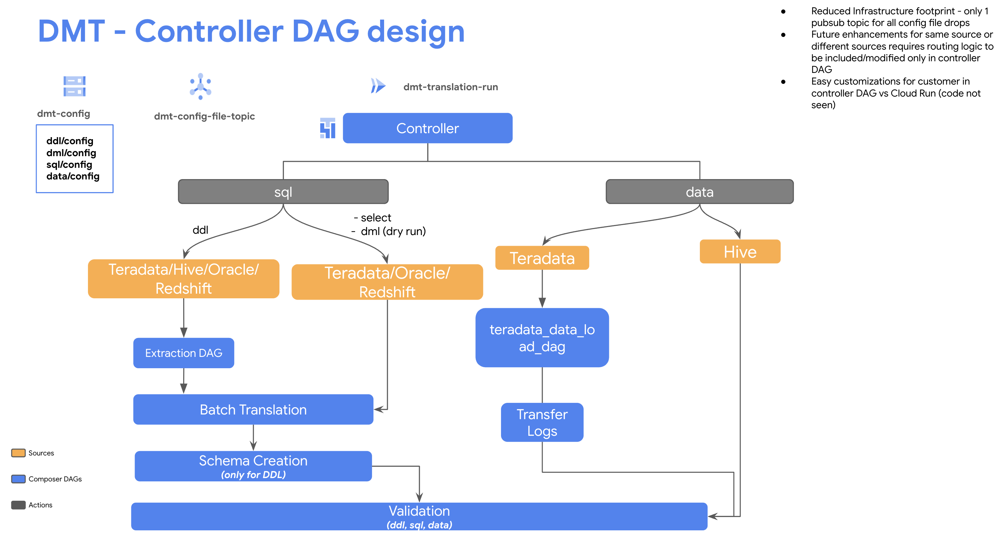
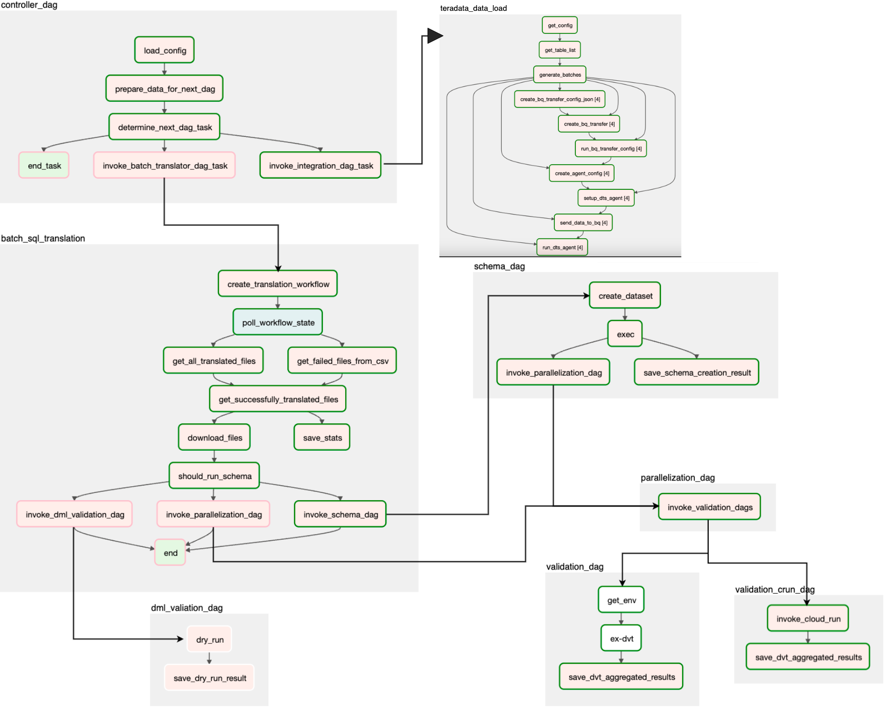
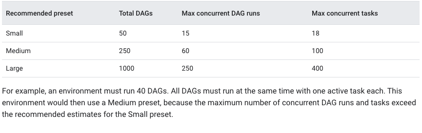

# Data Migration Tool Introduction
* For Installation user guide, please refer to [/docs/installation/README.md](/docs/installation/README.md)
* For Teradata data migration deployment user guide, please refer to [/docs/installation/README_teradata_datamigration.md](/docs/installation/README_teradata_datamigration.md)
* For Hive data migration deployment user guide, please refer to [/docs/installation/README_hive_datamigration.md](/docs/installation/README_hive_datamigration.md)
* For Redshift data migration deployment user guide, please refer to [/docs/installation/README_redshift_datamigration.md](/docs/installation/README_redshift_datamigration.md)
* For Flatfiles data migration deployment user guide, please refer to [/docs/installation/README_flat_files_datamigration.md](/docs/installation/README_flat_files_datamigration.md)

## Why you want to use Data Migration Tool
As customers migrate from on-prem enterprise data warehouses to the Cloud and specifically BigQuery, there is no single end-to-end migration path and/or solution, to make it easy and scalable. There are several tools available for SQL translation, data transfer and data validation, but these need to be configured, run and managed separately. All of this adds additional time, complexity and risk to the data warehouse migration effort. 

## What Data Migration Tool can provide you
The goal of this tool is to provide an end to end automated solution for customers to perform data transfer, translate and validate the DDL,DML and SQL queries to support data warehouse migrations to BigQuery. This solution is built using Google Cloud tools and services, such as the Data Validation Tool, BQ Translation Service, BigQuery Data Transfer Service, Cloud Composer Orchestrated DAGs etc. This tool should help accelerate migrations, reduce risk and improve time to value.

### Supported Sources
<table>
  <tr>
   <td>Sources
   </td>
   <td>Translation
   </td>
   <td>Schema Migration
   </td>
   <td>Data Transfer(Bulk Load)
   </td>
   <td>Incremental Load
   </td>
   <td>Validation
  </td>
  </tr>
  <tr>
   <td>Teradata
   </td>
   <td>Yes
   </td>
   <td>Yes
   </td>
   <td>Yes
   </td>
   <td>No
   </td>
   <td>Yes
   </td>
  </tr>
   <tr>
  <td>Hive
  </td>
  <td>Yes
  </td>
  <td>Yes
  </td>
  <td>Yes
  </td>
  <td>Yes
  </td>
  <td>Yes
  </td>
 </tr>
  <tr>
  <td>Redshift
  </td>
  <td>Yes
  </td>
  <td>Yes
  </td>
  <td>Yes
  </td>
  <td>No
  </td>
  <td>Yes
  </td>
 </tr>
  <tr>
  <td>Oracle
  </td>
  <td>Yes
  </td>
  <td>Yes
  </td>
  <td>No
  </td>
  <td>No
  </td>
  <td>Yes
  </td>
 </tr>
 <tr>
  <td>Flat files
  </td>
  <td>N/A
  </td>
  <td>N/A
  </td>
  <td>Yes
  </td>
  <td>N/A
  </td>
  <td>Yes
  </td>
 </tr>
  </table>

## User Story

Data Migration Tool(DMT) is an end-to-end orchestrated solution for migrating a data warehouse to BigQuery. This tool will help users conduct several operations to successfully translate, create and validate tables and transfer data from on-premise data warehouses such as Teradata/Hive to native GCP BQ tables. These operations include:

1. Automated extraction of DDLs
2. DDL translation, schema migration and schema validation.
3. Data migration and validation
4. DML translation and dry run validation
5. SQL translation and validation (#5 can be triggered after #3 only.)
6. Looker Studio dashboard templates for monitoring above listed migration steps.

### Extract and translate DDL from on-prem data warehouses into BigQuery DDL syntax.

1. Users copy their on-premises DDL file by manual or automated method, and a config file into a GCS bucket.
2. The config file will trigger Pub/Sub > CloudRun > Cloud Composer > BQ translation API for DDL translation.
3. The translated DDL will land into the GCS bucket.

### Create tables in BigQuery.

1. Cloud composer will create BQ tables using translated DDLs

### Validate Schema in BigQuery

1. A Composer DAG will validate schema in BQ.
2. Data Validation results will be written into BQ audit logging tables. 

### Transfer data from on-premise to BigQuery.

1. Choose one way to upload your data to BQ. Data Migration Tool provide a service to upload data via DTS for Teradata. For Hive, the prerequisite right now is to have the data files present in GCS buckets and load data using Composer DAGs to BQ.

### Translate SQL SELECT statements into BigQuery syntax.

1. Users copy their on-premises SQL file, and a config file into a GCS bucket.
2. The config file will trigger Pub/Sub > CloudRun > Cloud Composer > BQ translation API for SQL translation automatically.
3. The translated SQL and/or failed translation files will land into the GCS bucket.

### Validate SQL SELECT statements in BigQuery.

1. Data should be in BQ before this step.
2. A Composer DAG will validate the SELECT statement in BQ.
3. Validation results will be written into BQ. 

### Translate DML statements into BigQuery syntax.

1. There is no dependency on the step: “Translate SQL SELECT statements into BQ syntax”.
2. This is a dry run feature which translated provided DML queries from Teradata/Oracle/Redshift dialect to BigQuery dialect similar to DDL and SQL translations

### Validate DML statements in BigQuery.

1. Post the translation of DML statements into BQ dialect, we leverage the BigQuery Dry Run API feature to test the execution of DML files (dry run only) to validate if the translated DML query would work well without any errors at the BQ side.

## Design
The following design proposes how to orchestrate an end-to-end pipeline to run Translation, Migration and Validation for enterprise data warehouse migration to BigQuery. 

### Overview

### Controller

### DAG Overview

## Infrastructure/Services
The following products/tools will be used to build an end-to-end orchestrated pipeline which both migrates a data warehouse and then validates that migration was successful:

<table>
  <tr>
   <td>Activity
   </td>
   <td>Component
   </td>
  </tr>
  <tr>
   <td>Orchestration
   </td>
   <td>
<ul>

<li>Cloud Composer
</li>
</ul>
   </td>
  </tr>
  <tr>
   <td>Event-based Triggers
   </td>
   <td>
<ul>

<li>Cloud Run

<li>Cloud PubSub
</li>
</ul>
   </td>
  </tr>
  <tr>
   <td>SQL Translation
   </td>
   <td>
<ul>

<li>Cloud Storage

<li>BigQuery <a href="https://cloud.google.com/bigquery/docs/batch-sql-translator">Batch SQL Translator</a>
</li>
</ul>
   </td>
  </tr>
  <tr>
   <td>SQL Validation
   </td>
   <td>
<ul>

<li><a href="https://github.com/GoogleCloudPlatform/professional-services-data-validator">Data Validation Tool</a> (query validation)

<li>BigQuery API (jobs.insert with dryRun=True)	
</li>
</ul>
   </td>
  </tr>
  <tr>
   <td>Data Transfer
   </td>
   <td>
<ul>

<li><a href="https://cloud.google.com/bigquery/docs/reference/datatransfer/rest">Data Transfer Service</a> (data migration)

<li>Cloud Storage

<li>Pub/Sub

<li>BigQuery API
</li>
</ul>
   </td>
  </tr>
  <tr>
   <td>Infrastructure
   </td>
   <td>
<ul>

<li>Terraform/Terragrunt
</li>
</ul>
   </td>
  </tr>
  <tr>
   <td>Assets Storage
   </td>
   <td>
<ul>

<li>BigQuery

<li>Cloud Storage
</li>
</ul>
   </td>
  </tr>
  <tr>
   <td>Secret
   </td>
   <td>
<ul>

<li>Secret Manager
</li>
</ul>
   </td>
  </tr>
  <tr>
   <td>Results/Summary
   </td>
   <td>
<ul>

<li>Looker Studio
</li>
</ul>
   </td>
  </tr>
</table>

### Cloud Composer

Cloud Composer / Airflow will connect the different components together in a DAG, the file sensor will be able to trigger a new file arrival event from GCS.

The Composer instance should be created with the following characteristics:

* Version 2
* Private endpoint
* Custom service account (not default compute service account)
* Workload Identity binding GCP service account to ‘default’ GKE namespace

Refer to [this example](https://github.com/terraform-google-modules/terraform-google-composer/tree/master/examples/simple_composer_env_v2) of using the [Google-provided Composer V2 Terraform module](https://github.com/terraform-google-modules/terraform-google-composer/tree/master/modules/create_environment_v2) as a starting point.

### Cloud Run

Cloud Run will intercept GCS OBJECT_FINALIZE events and then decide whether to trigger Composer DAGs. The Cloud Run endpoint should be created with the following characteristics:

* Triggered via Cloud Storage [Object Finalize](https://cloud.google.com/functions/docs/calling/storage#finalize) events
* Private network; [Internal traffic only](https://cloud.google.com/functions/docs/networking/network-settings#ingress_settings)
* Custom service account (not default compute service account and not the same as custom Composer service account)

### Cloud Pub/Sub

Cloud Pub/Sub will serve as the message bus for the OBJECT_FINALIZE Cloud Storage events that are ultimately going to trigger Composer DAGs.

Pub/Sub invokes Cloud Run endpoint that ultimately triggers Composer DAGs.

### Cloud Storage

Cloud Storage will hold the following assets:

* Input DDL and SQL files (to be translated into BigQuery SQL)
* Configuration trigger file (holds settings for end-to-end translation pipeline)
* Output BigQuery SQL files (Output from Batch SQL translator)

### Batch SQL Translator

The Batch SQL Translator service will convert a customer’s source SQL assets (DDLs, Queries, UDFs, Stored Procs) into BigQuery SQL assets.

The Batch SQL Translator tool supports translation of the following SQL dialects:

* Amazon Redshift SQL
* Apache HiveQL
* Apache Spark SQL
* Azure Synapse T-SQL
* IBM Netezza SQL/NZPLSQL
* Oracle SQL, PL/SQL, Exadata
* Snowflake SQL
* SQL Server T-SQL
* Teradata SQL
* Vertica SQL
* Presto SQL

### BigQuery

The Data Validation Tool and our Composer DAGs will need the following BigQuery datasets and tables to run their tests:

* DVT BigQuery terraform dependencies are [specified here](https://github.com/GoogleCloudPlatform/professional-services-data-validator/blob/v2.0.0/terraform/main.tf)
* Composer DAG BigQuery terraform dependencies are [specified here](/terraform/translation/bq/main.tf)

### Data Validation Tool

The Data Validation Tool (DVT) is an open sourced Python CLI tool that will compare source tables with the equivalent migrated tables in BigQuery.

DVT (as it is used for this SQL migration service) has the following infrastructure dependencies:

* Connector for source database
* Connector for BigQuery as a target database
* BigQuery dataset/tables for writing validation results

### Looker Studio

Results of operations and statistics are curated in  Looker studio.

This is a template Looker Studio [Template](https://lookerstudio.google.com/c/reporting/a2f1550f-ba55-415c-93a0-4438a321d291/page/p_8odb7u9i5c?s=rpP1Zhm5vOo) - The customer can use this and switch data source and point it to their project->dataset->logging tables

Operations include: 

* Summary result
* DDL Translation results
* Schema creation & validation results
* Data migration & validation results
* SQL Translation & validations results
* DML Translation & validations results

Statistics include:

* Total count - Success, Failures
* Filters on error details, tables, sql, ddl and dml files

## Appendix

### DAG Parallelization & Composer Sizing

Airflow config overrides can help in optimizing parallelization for Schema and Validation DAGs.PLease refer to the below information to optimally size your Composer environments depending on the scaling required and the number of files to be translated and validated.

[Composer Optimization](https://cloud.google.com/composer/docs/composer-2/optimize-environments#optimization_process_overview)

[Airflow Documentation](https://airflow.apache.org/docs/apache-airflow/stable/configurations-ref.html#parallelism)

[Reference URL](https://cloud.google.com/blog/products/data-analytics/scale-your-composer-environment-together-your-business)

[Composer 1.0 Sizing](https://docs.google.com/spreadsheets/d/1z5m8yO67BqKpuxoIGxgKjqqKWyJ34U1dEdCBWHV7pTM/edit#gid=0)

Recommend setting up a Cloud Composer cluster with a relatively small number of powerful machines, keeping in mind that if the number of machines is too small, a failure of one machine will impact the cluster severely.

<table>
  <tr>
   <td><strong>Airflow Configuration Override Parameter</strong>
   </td>
   <td><strong>Default Value</strong>
   </td>
   <td><strong>Recommended Value</strong>
   </td>
  </tr>
  <tr>
   <td>[scheduler] Parsing_processes

<a href="https://cloud.google.com/composer/docs/composer-2/troubleshooting-scheduling#monitoring_running_and_queued_tasks">Link</a>
   </td>
   <td>2
   </td>
   <td>>=number_of_cores_per_node

e.g.) 2 x number_of_cores_per_node
   </td>
  </tr>
  <tr>
   <td>[celery] Worker_concurrency

<a href="https://cloud.google.com/composer/docs/composer-2/troubleshooting-scheduling#scaling_airflow_configuration">Link</a>
   </td>
   <td>12 * number of workers' CPUs
   </td>
   <td>6-8 * cores_per_node or per_3.75GB_ram

Ignored if worker_autoscale is set
   </td>
  </tr>
  <tr>
   <td>[core] parallelism
   </td>
   <td>32
   </td>
   <td>[Worker_concurrency] * Number of Workers
   </td>
  </tr>
  <tr>
   <td>[core] max_active_tasks_per_dag
   </td>
   <td>100
   </td>
   <td>Equal to [parallelism]
   </td>
  </tr>
  <tr>
   <td>[core] default_pool_task_slot_count
   </td>
   <td>128
   </td>
   <td>Equal to [parallelism]
   </td>
  </tr>
</table>
