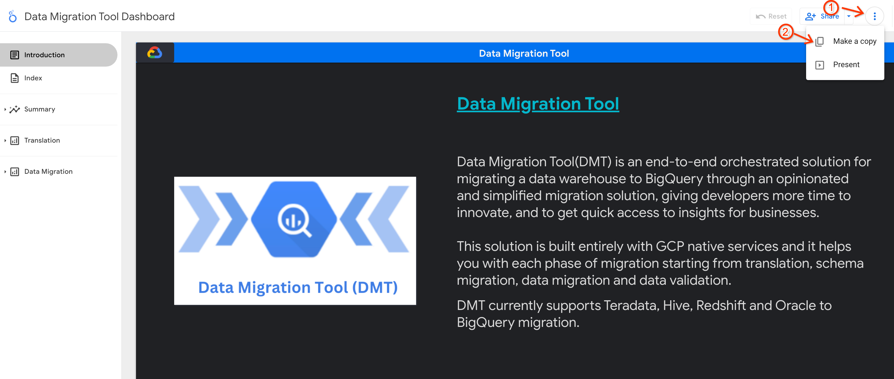
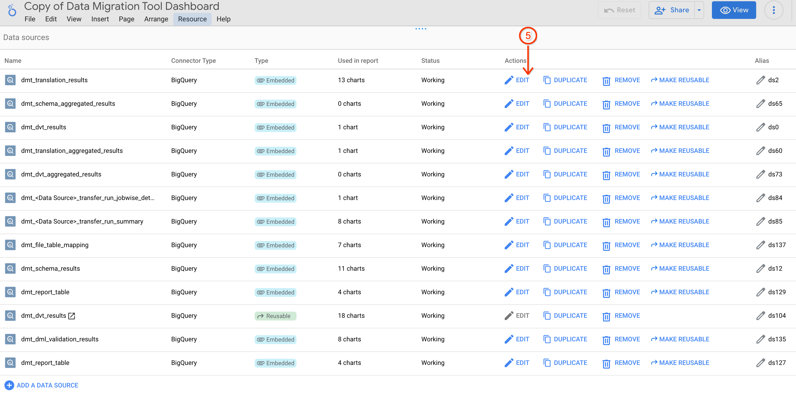
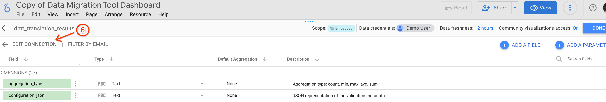
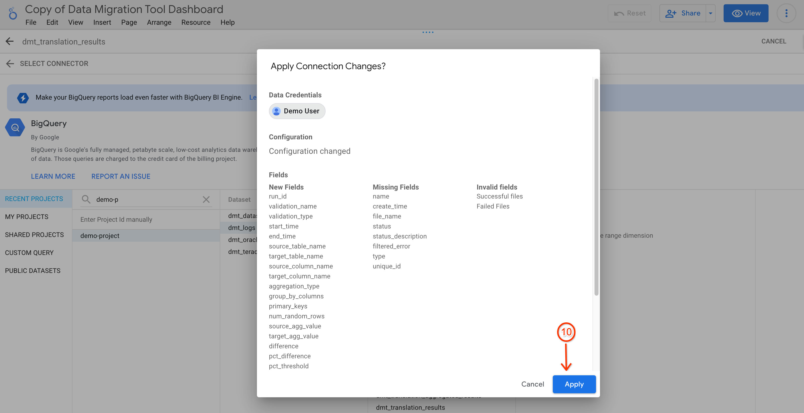
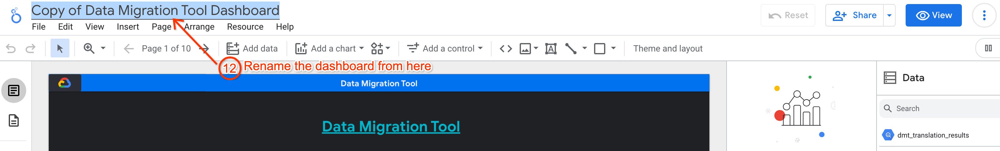

# DMT User Guide

> [!CAUTION]
> DMT is no longer under active development.


* For DMT introduction, please refer to [/README.md](/README.md)
* For Teradata data migration deployment user guide, please refer to [/docs/installation/README_teradata_datamigration.md](/docs/installation/README_teradata_datamigration.md)
* For Hive data migration deployment user guide, please refer to [/docs/installation/README_hive_datamigration.md](/docs/installation/README_hive_datamigration.md)
* For Redshift data migration deployment user guide, please refer to [/docs/installation/README_redshift_datamigration.md](/docs/installation/README_redshift_datamigration.md)

# About the Tool

## Prerequisites


* Firewall rules - enable firewall between the source database and Google Cloud VPC

   **[For Redshift]**

   For AWS Redshift connectivity, please refer guide [https://cloud.google.com/bigquery/docs/migration/redshift-vpc](https://cloud.google.com/bigquery/docs/migration/redshift-vpc)

   >Note:- It is necessary to create VPC GCC subnetwork region as the same region (in GCP) to which VPN tunnel is established (to connect to AWS Redshift cluster)


* **[Mandatory]** BigQuery Transfer Service Agent VM requires access to internet to update packages in Agent VM environment and hence the recommended approach is to have a Cloud NAT in place in the **same VPC, subnet and regions as your Teradata Agent VM**

    Cloud NAT is deployed automatically using default settings through terraform with standard naming conventions and automatic IP allocations.


    If you wish to use your own Cloud NAT and Cloud router with custom allocations ensure they are created before proceeding with the deployment.


    In the case of manual creation of Cloud NAT and Cloud router, to turn off automatic creation of Cloud NAT, change the value of the variable create_nat = “false” in **~/terraform/datamigration/gce/variables.tf** after cloning the DMT repository


    If you are okay with automatic NAT creation through terraform, please  proceed without any changes.


```
The Cloud Router and NAT should only be created in the same region where the VPC for Cloud Composer and Migration Agent VM are going to be created
```


```
The DVT Cloud Run and Cloud Composer should only be created in the same region.
```


## Assumptions


* Using Standard Deployment for infrastructure will ensure you have default (standard) names for GCP service, service accounts, and default folder structures. This is the recommended approach.
* By default, all services will be followed by the project-id to denote unique identifier names for all buckets and services. If you wish to change this ensure that you provide the substitution parameter for _MY_CUSTOMER_NAME as part of gcloud builds submit command later during deployment
* The tool will deploy by default using below location/regions
    * us-central1-a
    * US location

    To change the locations, go to variables.tf file under each GCP service terraform module and update the location values according to your requirements before running the Bash wrapper script for Infrastructure deployment.


    It is recommended to keep the migration pipeline components in the same regions as much as possible.

* By default, GCP services requiring a VPC and subnet will be deployed in default VPC and subnet. To provide custom VPCs and subnets, go to variables.tf file under each applicable GCP service terraform module and update the vpc names and subnet names. This step is applicable for
    * Cloud Composer (gcc)
    * Teradata Agent Compute Engine VM (gce)
    * Cloud Run


## General Limitations


* Best practice - provide input DDLs and SQLs  in the form of one DDL  or SQL query per file.
* Incremental data migration is supported for HIVE only.


## Feature Limitations


* Current release supports DDLs and SELECT queries only. DML statements will be supported with dry run option only.
* Current release doesn't support data transfer for Oracle or Incremental data load for Teradata, Redshift.

# DMT Deployment

Deployment of DMT through terraform modules is split into 2 parts

* Translation – For DDL, DML, SQL translation and validation.
* Data Migration - For data migration from different sources (Teradata and Hive)


## Clone the DMT GitHub repository

The code repository is hosted on Github. Clone it and check out the main branch using the commands below.

```
git clone https://github.com/GoogleCloudPlatform/data-migration-tool
cd data-migration-tool
git checkout main
```

## Set project environment variables
```
export SOURCE_PROJECT=<YOUR_PROJECT_ID>
```

```
gcloud config set project $SOURCE_PROJECT
```

## Assign Admin and Executing User Permissions

There are two main personas for DMT - the Admin and the User. The Admin is responsible for managing DMT infrastructure (such as granting permissions to the Cloud Build service account which executes the Terraform deployment). The User is responsible for using DMT post-deployment for migration activities, such as triggering SQL translation or data validation.

We provide scripts to assign the required permissions for each of these personas by a superadmin. This includes creating two custom roles with a limited set of granular permissions.

Set the following environment variables for the Admin and User, and then execute the provided bash scripts to create the custom roles and IAM permission bindings.

```
 export ADMIN_ACCOUNT=<EXECUTING_ADMIN_ACCOUNT>
```

```
 export USER_ACCOUNT=<EXECUTING_USER_ACCOUNT>
```

```
bash dmt-admin-custom-role-creation.sh
bash dmt-user-custom-role-creation.sh
```

```
bash dmt-admin-user-iam-setup.sh
bash dmt-user-iam-setup.sh
```


## Enable Google Cloud APIs

From the Cloud Shell, you can enable Google Cloud Services using the gcloud command line interface in your Google Cloud project.

```
gcloud services enable serviceusage.googleapis.com \
			     cloudresourcemanager.googleapis.com \
			     cloudbuild.googleapis.com
```


## IAM permissions for Cloud Build Service Account

The Cloud Build service account needs to be granted the following IAM roles to be able to deploy DMT using Terraform. If no `BUILD_ACCOUNT` environment variable is specified, the project's default Cloud Build service account is used.

**IAM roles required for the created Service Account**

```
Artifact Registry Administrator
BigQuery Admin
Cloud Build Service Account
Cloud Run Admin
Composer Administrator
Compute Instance Admin (v1)
Compute Network Admin
Create Service Accounts
Logs Viewer
Project IAM Admin
Pub/Sub Admin
Secret Manager Admin
Service Account User
Service Usage Admin
Storage Admin
```


**To assign these roles, you can execute the Bash script cloudbuild-sa-iam-setup.sh present in the root directory**

```
export BUILD_ACCOUNT=<CLOUDBUILD_SERVICE_ACCOUNT>  # If not specified, the default Cloud Build SA is used.

bash cloudbuild-sa-iam-setup.sh
```

Once the execution of the bash script is successful, you can proceed to the next step [Deploying DMT Infrastructure](#deploying-dmt-infrastructure).


## Deploying DMT infrastructure

Translations deployment will take care of the workflow needed to perform


* DDL, DML and SQL translations
* Schema migration to BQ (Creation of tables from translated DDLs)
* Schema Validation and Custom query(row/column for SQL validation) using [DVT tool](https://github.com/GoogleCloudPlatform/professional-services-data-validator)
    * Options to run DVT on cloud run and GKE airflow pod operator depending on scaling requirements.

**<span style="text-decoration:underline;">Note</span>** : SQL translation and validation can only be run after data loading
happens into Bigquery

If you choose the deployment of Translation + Data Migration, in addition to the translation activities mentioned above, you will be able to
* Perform initial data loads
* Row and column data validation using [DVT tool](https://github.com/GoogleCloudPlatform/professional-services-data-validator)


### Pre deployment Steps

#### 1. Before you proceed with DMT terraform deployment, ensure that there is a GCS bucket created to store Terraform infrastructure State Files


```
gcloud storage buckets create gs://${SOURCE_PROJECT}-dmt-state-bucket
```


#### 2. [Mandatory for Oracle] Before you proceed with DMT terraform deployment, ensure that Oracle client .RPM library is uploaded in the GCS bucket

Guideline to download oracle_client_rpm_file and upload in GCS bucket -

   1) Download oracle instant client library(.rpm extension) file from Oracle downloads: [https://www.oracle.com/in/database/technologies/instant-client/linux-x86-64-downloads.html](https://www.oracle.com/in/database/technologies/instant-client/linux-x86-64-downloads.html)

   2) Upload the file in GCS bucket

   ```
   gsutil cp <downloaded_oracle_client_rpm_file> gs://<gcs_bucket>/<nested_folders_if_any>/
   ```
   (File can also be uploaded using cloud console)

   > It is advisable that oracle client rpm file name should be same as downloaded

   3) Set the below environment variables(This would be used while running deployment command) -

   ```
   export ORACLE_RPM_GCS_BUCKET_PATH=<Fully Qualified RPM file GCS bucket path>
   ```
   > For example, Fully Qualified RPM file GCS bucket path is `gs://<gcs_bucket>/<nested_folders_if_any>/downloaded_filename.rpm`

   ```
   export ORACLE_INSTANT_CLIENT_LIB_VERSION=<Oracle_Instant_Client_Lib_Version>
   ```
   > The version canbe found from the downloaded file or from the Oracle download page from where the library is downloaded

Note: This library is required by data validation tool and while running deployment command it is required to pass library details as substitution parameters


#### 3. Mandatory for Shared VPC network configuration in Cloud Composer

In Shared VPC networking designated host project provides VPC network and sub-network to the service project where cloud composer environment would be deployed. The service project must be attached with host project to use the VPC.

Perform below predeployment steps to setup/configure shared VPC for composer -

   1. Setup the environment variable if it doesn't exist.

   ```
   export HOST_PROJECT=<HOST_PROJECT_ID>
   ```

   ```
   export SOURCE_PROJECT=<YOUR_PROJECT_ID>
   ```

   2. Network resource configuration - VPC network should have subnetwork with the region available for cloud composer [see available regions list under Products available by location section](https://cloud.google.com/about/locations#regions) deployment. Subnetwork should have 2 Secondary IP ranges created explicitly which is required for GKE pods and services.

   Note:-

   - Mask size for secondary IP ranges should be between /9 to /23 bits based on composer environment size.

      > For Example, /17 and /22 is recommended for medium composer environment.

   - While creating subnet or using existing one Enable Private Google Access (This would be recomended even if plan is to use Public IP environments)

   3. Enable GKE API in your host and service projects if not enabled

   ```
   gcloud services enable container.googleapis.com --project $HOST_PROJECT
   gcloud services enable container.googleapis.com --project $SOURCE_PROJECT
   ```

   4. Provide below permission to service project service account **in host project** -

      a. Create environment variable for service project number(Service project number is available in dashboard page of project under Project info section) -

      ```
      export SERVICE_PROJECT_NUMBER=<service_project_number>
      ```

      b. Provide **Compute Network User** Permission to Google APIs service agent


      ```
      export GOOGLE_API_SERVICE_AGENT=$SERVICE_PROJECT_NUMBER@cloudservices.gserviceaccount.com
      ```

      ```
      gcloud projects add-iam-policy-binding $HOST_PROJECT \
      --member="serviceAccount:$GOOGLE_API_SERVICE_AGENT" \
      --role="roles/compute.networkUser"
      ```

      c. Provide **Compute Network User** and **Kubernetes Engine Host Service Agent User** Permission to GKE service agent


      ```
      export GKE_SERVICE_AGENT=service-$SERVICE_PROJECT_NUMBER@container-engine-robot.iam.gserviceaccount.com
      ```


      ```
      gcloud projects add-iam-policy-binding $HOST_PROJECT \
      --member="serviceAccount:$GKE_SERVICE_AGENT" \
      --role="roles/compute.networkUser"
      ```


      ```
      gcloud projects add-iam-policy-binding $HOST_PROJECT \
      --member="serviceAccount:$GKE_SERVICE_AGENT" \
      --role="roles/container.hostServiceAgentUser"
      ```


      d. Provide Permission to Composer Service Agent ([Composer public docs](https://cloud.google.com/composer/docs/composer-2/configure-shared-vpc))

         1. For **Private IP environments**, grant the **Composer Shared VPC Agent** permission to the Composer Service Agent Account

         ```
         export COMPOSER_SERVICE_AGENT=service-$SERVICE_PROJECT_NUMBER@cloudcomposer-accounts.iam.gserviceaccount.com
         ```

         ```
            gcloud projects add-iam-policy-binding $HOST_PROJECT \
            --member="serviceAccount:$COMPOSER_SERVICE_AGENT" \
            --role="roles/composer.sharedVpcAgent"
         ```

         2. OR, for  **Public IP environments**, grant the **Compute Network User** permission to Composer Agent Service Account instead

         ```
         export COMPOSER_SERVICE_AGENT=service-$SERVICE_PROJECT_NUMBER@cloudcomposer-accounts.iam.gserviceaccount.com
         ```

         ```
            gcloud projects add-iam-policy-binding $HOST_PROJECT \
            --member="serviceAccount:$COMPOSER_SERVICE_AGENT" \
            --role="roles/compute.networkUser"
         ```


For more information and references please visit [Configure Shared VPC networking documentation](https://cloud.google.com/composer/docs/composer-2/configure-shared-vpc)


### Terraform Deployment


1. Set default GCP project in your Cloud Shell or terminal or bastion host with Terraform, Terragrunt and gcloud SDK installed

```
gcloud config set project ${SOURCE_PROJECT}
```


2. Check the current project

```
gcloud config get project
```


3. Run the command

```
gcloud auth application-default login
```


4. Login with your Google Cloud credentials and ensure you have the required IAM permissions listed in the step [Assign Executing User Permissions]

5. DMT tool leverages default VPC network and subnetwork for Cloud Composer and Teradata Agent VM Compute Engine. If you wish to use a custom VPC and subnet, provide the right values for custom VPC and subnet in these files

**~/terraform/translation/gcc/variables.tf**
**~/terraform/datamigration/gce/variables.tf**

**Note :** DMT tool does not create VPC and subnets, these should be created beforehand.

It is recommended to use the same VPC and subnet for Cloud Composer and Teradata Agent VM with the VPC and subnet able to access source Teradata and Hive Data Warehouses necessary ports.

**~/terraform/translation/gcc/variables.tf**
[Click here to view source file](/terraform/translation/gcc/variables.tf)


**~/terraform/datamigration/<datasource>/gce/variables.tf**


6. If you would like to customize additional variables, please ensure the appropriate values are set for those variables in variables.tf file in each services’ folder - **pubsub, gcc, gcs, bq, cloudrun**

    **~/terraform/translation/gcs/variables.tf**


    **~/terraform/translation/pubsub/variables.tf**


    **~/terraform/translation/cloudrun/variables.tf**


    **~/terraform/translation/gcc/variables.tf**


    **~/terraform/translation/bq/variables.tf**

(Note: Please note that region for cloud composer and dvt cloud run should be same)

7. Navigate inside the dmt repo

```
cd data-migration-tool
```


```
gcloud builds submit . --project ${SOURCE_PROJECT} \
--config cloudbuild_deploy.yaml \
--substitutions \
_DATA_SOURCE=<source data warehouse>
```


Cloud build DMT uses the following default values

  -   PROJECT_ID=${PROJECT_ID}

  - _MY_BUCKET_NAME=${PROJECT_ID}-dmt-state-bucket

  - _MY_CUSTOMER_NAME=${PROJECT_ID}

  - _DELETE_BQ_TABLES="false"

If you wish to change the default customer name tagged as suffix for all services and also change the name of the bucket for storing Terraform State Files (should be created beforehand)

Provide the values as substitution variables in gcloud builds command

For example,

If bucket name for state files = **demo-state**

Required customer name = **democust**

```
gcloud builds submit . --project ${SOURCE_PROJECT} \
--config cloudbuild_deploy.yaml \
--substitutions \
_MY_BUCKET_NAME=demo-state,_MY_CUSTOMER_NAME=democust,_DATA_SOURCE=hive
```

Otherwise DMT deploys with default predefined naming conventions for State File GCS bucket and Customer Name


Default false value of _DELETE_BQ_TABLES won't allow to delete BigQuery tables when you want to destroy DMT infrastructure in future. So if you wish to destroy BigQuery tables with destroy script, set the value to true in gcloud builds command.

For example,

```
gcloud builds submit . --project ${SOURCE_PROJECT} \
--config cloudbuild_deploy.yaml \
--substitutions \
_DELETE_BQ_TABLES="true",_DATA_SOURCE=<data_source>
```

Otherwise DMT deploys with default predefined values.


Additional substitution variable for **Oracle data source**
   - _ORACLE_INSTANTCLIENT_FILE_PATH=${ORACLE_RPM_GCS_BUCKET_PATH}
   - _ORACLE_ODBC_VERSION_NUMBER=${ORACLE_INSTANT_CLIENT_LIB_VERSION}

   > Used environment variable created in pre-deployment steps

For instance, if you would like to leverage DMT for

**Teradata to BigQuery Migration**


```
gcloud builds submit . --project ${SOURCE_PROJECT} \
--config cloudbuild_deploy.yaml \
--substitutions \
_DATA_SOURCE=teradata
```


**Hive to Bigquery Migrations**


```
gcloud builds submit . --project ${SOURCE_PROJECT} \
--config cloudbuild_deploy.yaml \
--substitutions \
_DATA_SOURCE=hive
```

**Oracle to Bigquery Migrations**


```
gcloud builds submit . --project ${SOURCE_PROJECT} \
--config cloudbuild_deploy.yaml \
--substitutions \
_ORACLE_INSTANTCLIENT_FILE_PATH=${ORACLE_RPM_GCS_BUCKET_PATH},_ORACLE_ODBC_VERSION_NUMBER=${ORACLE_INSTANT_CLIENT_LIB_VERSION}
```


**_Note:_**

If Data Migration is not required, you can choose to skip _DATA_SOURCE substitution variable which will only deploy the DMT Translation Architecture

   - Oracle initial release supports only schema migration so `_DATA_SOURCE` substitution variable not required.

All the available deployment configurations and corresponding gcloud build commands are listed below -


<table>
  <tr>
   <td>DMT Purpose
   </td>
   <td>Source
   </td>
   <td>Command
   </td>
  </tr>
  <tr>
   <td>Translation Only
   </td>
   <td>All Sources (except Oracle)
   </td>
   <td><code>gcloud builds submit . --project ${SOURCE_PROJECT} \ \
--config cloudbuild_deploy.yaml</code>
   </td>
  </tr>
  <tr>
   <td>Translation for Oracle
   </td>
   <td>Oracle
   </td>
   <td><code>gcloud builds submit . --project ${SOURCE_PROJECT} \
--config cloudbuild_deploy.yaml \
--substitutions \
_ORACLE_INSTANTCLIENT_FILE_PATH=${ORACLE_RPM_GCS_BUCKET_PATH},_ORACLE_ODBC_VERSION_NUMBER=${ORACLE_INSTANT_CLIENT_LIB_VERSION}</code>
   </td>
  </tr>
  <tr>
   <td>Translation + Data Migration
   </td>
   <td>Teradata
   </td>
   <td><code>gcloud builds submit . --project ${SOURCE_PROJECT} \
--config cloudbuild_deploy.yaml \
--substitutions \
_DATA_SOURCE=teradata</code>
   </td>
  </tr>
  <tr>
   <td>Translation + Data Migration
   </td>
   <td>Hive
   </td>
   <td><code>gcloud builds submit . --project ${SOURCE_PROJECT} \
--config cloudbuild_deploy.yaml \
--substitutions \
_DATA_SOURCE=hive</code>
   </td>
  </tr>
    <tr>
   <td>Translation + Data Migration
   </td>
   <td>Redshift
   </td>
   <td><code>gcloud builds submit . --project ${SOURCE_PROJECT} \
--config cloudbuild_deploy.yaml \
--substitutions \
_DATA_SOURCE=redshift</code>
   </td>
  </tr>
</table>


**Script execution starting logs**
```
starting build "206986f5-4e41-48f6-bff7-xyz"

FETCHSOURCE
Fetching storage object: gs://dmt-1_cloudbuild/source/1684304084.135633-xyz.tgz#1684304086786340
Copying gs://dmt-1_cloudbuild/source/1684304084.135633-xyz.tgz#1684304086786340...
/ [0 files][    0.0 B/115.2 KiB]
/ [1 files][115.2 KiB/115.2 KiB]
Operation completed over 1 objects/115.2 KiB.
BUILD
Pulling image: gcr.io/google.com/cloudsdktool/cloud-sdk:latest
latest: Pulling from google.com/cloudsdktool/cloud-sdk
918547b94326: Pulling fs layer
9ecbbb83fff4: Pulling fs layer
831b9ef5c145: Pulling fs layer
4718bdb8c7d1: Pulling fs layer
671167368ac0: Pulling fs layer
014f91216bbc: Pulling fs layer
4718bdb8c7d1: Waiting
671167368ac0: Waiting
014f91216bbc: Waiting
831b9ef5c145: Verifying Checksum
9ecbbb83fff4: Verifying Checksum
9ecbbb83fff4: Download complete
918547b94326: Verifying Checksum
918547b94326: Download complete
014f91216bbc: Verifying Checksum
014f91216bbc: Download complete
671167368ac0: Verifying Checksum
671167368ac0: Download complete
918547b94326: Pull complete
9ecbbb83fff4: Pull complete
831b9ef5c145: Pull complete
4718bdb8c7d1: Download complete
4718bdb8c7d1: Pull complete
671167368ac0: Pull complete
014f91216bbc: Pull complete
```


8. This automated infra setup for GCS, Pubsub, Cloud Composer, Cloud Run, BQ DVT dataset is expected to take approximately **35-45 minutes to complete. Cloud Composer creation takes the most amount of time**

You can monitor the status of the Deployment in your Cloud Build Logs by navigating to below path -

Google Cloud Console -> Cloud Build -> History


Since the chosen option is Translation + Data Migration for Teradata

Cloud Build will automatically trigger the deployment of Data Migration architecture as well.


```
Successful execution log -
Apply complete! Resources: 2 added, 0 changed, 0 destroyed.
google_compute_router.router[0]: Still creating... [20s elapsed]
google_compute_router.router[0]: Creation complete after 21s [id=projects/dmt-1/regions/us-central1/routers/dmt-cloud-router]
google_compute_router_nat.nat[0]: Creating...
google_compute_router_nat.nat[0]: Still creating... [10s elapsed]
google_compute_router_nat.nat[0]: Still creating... [20s elapsed]
google_compute_router_nat.nat[0]: Creation complete after 22s [id=dmt-1/us-central1/dmt-cloud-router/dmt-cloud-nat]
google_compute_disk.dm-disk-terdata-bq: Creating...
google_compute_disk.dm-disk-terdata-bq: Creation complete after 1s [id=projects/dmt-1/zones/us-central1-a/disks/dm-disk-terdata-bq]
google_compute_instance.dm-vm-teradata-bq: Creating...
google_compute_instance.dm-vm-teradata-bq: Still creating... [10s elapsed]
google_compute_instance.dm-vm-teradata-bq: Creation complete after 12s [id=projects/dmt-1/zones/us-central1-a/instances/dm-vm-teradata-bq]

Apply complete! Resources: 10 added, 0 changed, 0 destroyed.
PUSH
DONE

```


### Post-Installation setup

**Follow the below steps for Teradata and Oracle**


1. Ensure you have an existing source database environment for testing, with network connectivity to the project's VPC:

* For Teradata,
   * If you do not have one, you can create one [following the steps here](https://quickstarts.teradata.com/vantage.express.gcp.html).
   * If you want to follow the Qwiklab to set up TD instance with tpch installed when finished, you can [follow the steps here](https://gcpstaging.qwiklabs.com/catalog_lab/25971).
* For Oracle,
   * If you do not have one,  you can create one [following the steps here](https://github.com/oracle/docker-images/tree/main/OracleDatabase/SingleInstance).


   **<span style="text-decoration:underline;">Note</span>**. For real customer use cases, firewall ports from Composer Cluster Pod Address Range should be able to reach the  on-prem Teradata/ Oracle instance through firewall rules being created

   * [Teradata TCP DB connection port](https://docs.teradata.com/r/Teradata-Unity-Installation-Configuration-and-Upgrade-Guide-for-Customers/January-2018/Overview/Ports-Used-by-Unity)
   * [Oracle TCP DB connection port](https://docs.oracle.com/en/database/oracle/oracle-database/19/ladbi/oracle-database-component-port-numbers-and-protocols.html#GUID-B530F5CD-DD07-44D9-8499-0828B716C3A8)


   **<span style="text-decoration:underline;">Note</span>** (Real customer use cases): please create vpc access connectors as part of the VPC that has firewalls open to connect to customer’s on prem teradata instance. The Cloud Run service (to execute the DVT tool) requires the VPC access connector to be attached to it to hit the Teradata/Oracle DB.
   * [Teradata TCP DB connection port](https://docs.teradata.com/r/Teradata-Unity-Installation-Configuration-and-Upgrade-Guide-for-Customers/January-2018/Overview/Ports-Used-by-Unity).
   * [Oracle TCP DB connection port](https://docs.oracle.com/en/database/oracle/oracle-database/19/ladbi/oracle-database-component-port-numbers-and-protocols.html#GUID-B530F5CD-DD07-44D9-8499-0828B716C3A8).

   **<span style="text-decoration:underline;">Note</span>** (_If you are a Googler_): _If you are a Googler and are running a test environment with Teradata Express edition or Oracle on GCP Compute VMs, ensure you add a network tag cc-dvt to the on TD/Oracle instance.


2. Go to Secret Manager and create a new secret with the name **secret-edw_credentials**

    This should contain the password for Teradata/Oracle DB. It is recommended to keep the name of the secret as **secret-edw_credentials**


1. Validate if all DAG Airflows in the Cloud Composer instance are in paused state through Airflow URI

2. Switch all the DAG status to Active

3. Validate **workload_identity_creator_dag in Airflow UI** is executed one time automatically on turning DAGs active and is successful


8. If you intend to migrate tables over to BQ dataset other than dmt-teradata-dataset, please ensure this dataset is manually created and is provided in the config files later  (create tables from DDLs)

9.  **(Mandatory for Teradata DDL Extraction)** Teradata DDL extraction requires Teradata JDBC JAR. Upload the JDBC JAR file to your GCS config bucket under the `software/teradata` folder as shown below:

      1) Download the JAR from teradata downloads: 	[https://downloads.teradata.com/download/connectivity/jdbc-driver](https://downloads.teradata.com/download/connectivity/jdbc-driver)

      2) Upload the JAR to your GCS config bucket and ensure that the file name is exactly `terajdbc4.jar`. \
      Make sure the file is placed in the `software/teradata` path \
      (e.g. `gs://YOUR_DMT_CONFIG_BUCKET/software/teradata/terajdbc4.jar`)

10. **(Optional - Only for Oracle)** Remove GCS bucket created to store .RPM file for setup.


**Build connection between CloudRun and Source database [Applicable for network connectivity uses VPN connectivity]**

1. Set environment variable in Cloud Shell:

```
export SOURCE_PROJECT=<YOUR_DMT_PROJECT_ID>
```

1. Create serverless VPC Connector (specify same network as well as region which has firewall rules allowed to connect to on prem/ cloud data source)

```
gcloud compute networks vpc-access connectors create crun-dvt-connector \
--project $SOURCE_PROJECT \
--network default \
--region us-central1 \
--range 10.6.0.0/28 \
--min-instances 2 \
--max-instances 3 \
--machine-type f1-micro
```

2. Attach the network tag **cc-dvt** as the target or provide directly the IP address of the on prem TD/Oracle instance. (This tag can be used as target tag while creating a firewall rule at a later stage)

3. Create an ingress firewall rule (in source database network) to deny traffic from connector network tag:

```
gcloud compute firewall-rules create deny-vpc-connector --action=DENY --rules=all --source-tags=vpc-connector-us-central1-crun-dvt-connector --direction=INGRESS --network=default --priority=990
```

4. Create an ingress firewall rule targeting the Teradata/Oracle IP that you want the VPC connector to access. Set the priority for this rule to be a lower value than the priority of the rule you made in Step 25. (Here **cc-dvt **is the network tag attached to Teradata/Oracle VM)

```
gcloud compute firewall-rules create allow-vpc-connector-for-select-resources --allow=all --source-tags=vpc-connector-us-central1-crun-dvt-connector --direction=INGRESS --network=default --target-tags=cc-dvt --priority=980
```

5. Deploy a new version of the Cloud Run DVT service ([edw-dvt-tool-](https://console.cloud.google.com/run/detail/us-central1/edw-dvt-tool-control?project=dmt-test-12)&lt;customerid>) after performing the below changes
    1. Setting the connector
    
    2. Go to the Secrets section in Cloud Run and configure as shown below:
         - Secret: **secret-edw_credentials**
         - Reference Method **:  Exposed as Environment variable**
         - Environment_variables
           - Name 1: **edw_credentials**

         


## Trigger DMT

* Translations
* Schema Migration to Google BigQuery
* Schema Validation
1. Prepare sample config.json file including Input/output buckets, translation type (DDL, SQL or DML), dialects, Name mapping properties and DVT connection details
2. Upload required SQL and DDL files into respective bucket paths defined in config.json

    For example,


    **DDL** = gs://dmt-translation-control/input/ddl


    **SQL** =  gs://dmt-translation-control/input/sql (SQL files), gs://dmt-translation-control/input/sql/ddl (DDL/Metadata files)


    **DML** =  gs://dmt-translation-control/input/dml (DML files), gs://dmt-translation-control/input/sql/ddl (DDL/Metadata files)

3. Upload config.json into the config folder of the bucket

    For example,

    **DDL** = gs://dmt-config-control/input/ddl

    **SQL** = gs://dmt-config-control/input/sql

    **DML** = gs://dmt-config-control/input/dml

4. In case of DDL - validate execution of DAGs
    1. [controller_dag](/src/translation/dags/controller_dag.py)
    2. [extract_ddl_dag](/src/translation/dags/extract_ddl_dag.py) - if extract_ddl is yes
    3. [batch_sql_translation](/src/translation/dags/batch_sql_translation.py)
    4. [schema_dag](/src/translation/dags/schema_dag.py)
    5. [validation_dag](/src/translation/dags/validation_dag.py)
        1. [validation_dag](/src/translation/dags/validation_dag.py) - if validation_mode is gke
        2. validation_crun if validation_mode is cloudrun

5. In case of SQL - validate execution of DAGs
    1. Controller_dag
    2. [Batch_sql_translation](/src/translation/dags/batch_sql_translation.py)
    3. [validation_dag](/src/translation/dags/validation_dag.py)
       1. validation_dag - if validation_mode is gke
       2. validation_crun if validation_mode is cloudrun

6. In case of DML - validate execution of DAGs
    1. Controller_dag
    2. [Batch_sql_translation](/src/translation/dags/batch_sql_translation.py)
    3. Dml_validation_dag

7. Translated DDL and SQL files can be found in output buckets

    **DDL** = gs://dmt-translation-control/output/ddl


    **SQL** = gs://dmt-translation-control/output/sql


    **DML** = gs://dmt-translation-control/output/dml

8. Translation Summary results can be found in the output buckets along with translated files - **batch_translation_report.csv**


### Sample config.json

[Click here for sample config.json files](/samples/configs)

### Configuration JSON Attributes


#### **DDL**


<table>
  <tr>
   <td><strong>JSON attribute</strong>
   </td>
   <td><strong>Description</strong>
   </td>
  </tr>
  <tr>
   <td>
    batchDistribution
   </td>
   <td>Defines the number of parallel Composer Airflow DAGs
<p>
<strong><em>[Number of DAGs = Total DDL files/batchDistribution]</em></strong>
   </td>
  </tr>
  <tr>
   <td>
    extract_ddl
   </td>
   <td>Provide flag for ddl/schema extraction from source database
   </td>
  </tr>
  <tr>
   <td>
    unique_id
   </td>
   <td>Provide an unique name for every batch run identification
   </td>
  </tr>
  <tr>
   <td>
    type
   </td>
   <td>Type of Translation : ddl
   </td>
  </tr>
  <tr>
   <td>
    source
   </td>
   <td>Source datawarehouse : teradata
   </td>
  </tr>
  <tr>
   <td>
    translationErrorFilterRules
<p>

    {field, matchtype, value}
   </td>
   <td>Field : Category
<p>
Matchtype : equals
<p>
Value : &lt;>
<p>
Allows bypassing of warnings and BQ dialect translation errors;
<p>
Example  Values - NoTargetSupportForFeature, NoTargetSupportForSetTables, NoTargetSupportForIndexBackedConstraints, NoTargetSupportForPartitionSemantics
   </td>
  </tr>
  <tr>
   <td>
    migrationTask: type
   </td>
   <td>Translation_Teradata2BQ
   </td>
  </tr>
  <tr>
   <td>
    migrationTask:translationConfigDetails:sourceDialect:teradataDialect:mode
   </td>
   <td>Teradata - SQL, BTEQ
   </td>
  </tr>
  <tr>
   <td>
    migrationTask:translationConfigDetails:sourceEnv:defaultDatabase
   </td>
   <td>BigQuery GCP Project ID
   </td>
  </tr>
  <tr>
   <td>
    migrationTask:translationConfigDetails:targetDialect:bigqueryDialect
   </td>
   <td>{}
   </td>
  </tr>
  <tr>
   <td>
    gcsSourcePath
   </td>
   <td>GCS location of input DDL Teradata Files
   </td>
  </tr>
  <tr>
   <td>
    gcsTargetPath
   </td>
   <td>GCS location where translated output DDL BQ dialect Files must be placed
   </td>
  </tr>
  <tr>
   <td>
    nameMappingList:name_map:source
<p>

    {type, database,schema}
   </td>
   <td>Create output name mapping for schema translations for source
<p>
Refer to <a href="https://cloud.google.com/bigquery/docs/output-name-mapping">https://cloud.google.com/bigquery/docs/output-name-mapping</a>
   </td>
  </tr>
  <tr>
   <td>
    nameMappingList:name_map:target
<p>

    {database,schema}
   </td>
   <td>Create output name mapping for schema translations for target BQ
<p>
Refer to <a href="https://cloud.google.com/bigquery/docs/output-name-mapping">https://cloud.google.com/bigquery/docs/output-name-mapping</a>
   </td>
  </tr>
  <tr>
   <td>
    validation_config:source_config:source_type
   </td>
   <td><strong>DVT Validation</strong>
<p>
Source datawarehouse : Teradata
   </td>
  </tr>
  <tr>
   <td>
    validation_config:source_config:host
   </td>
   <td>hostname/ IP address of on-prem Teradata
   </td>
  </tr>
  <tr>
   <td>
    validation_config:source_config:port
   </td>
   <td>Port number of on-prem Teradata
   </td>
  </tr>
  <tr>
   <td>
    validation_config:source_config:user-name
   </td>
   <td>User-name with permissions to query on source tables
   </td>
  </tr>
  <tr>
   <td>
    validation_config:source_config:password
   </td>
   <td>Secret Manager key name
<p>
<strong>secret- &lt;secret key name></strong>
<p>
For example - secret-edw_credentials
   </td>
  </tr>
  <tr>
   <td>
    validation_config:target_config:target_type
   </td>
   <td>BigQuery
   </td>
  </tr>
  <tr>
   <td>
    validation_config:target_config:project-id
   </td>
   <td>BigQuery GCP Project ID
   </td>
  </tr>
  <tr>
   <td>
    validation_config:validation_params_file_path
   </td>
   <td>GCS location of the CSV file or Excel sheet, containing table or file names along with DVT Validation Flags.
   <p>
   Examples:

   gs://dmt-config-dmt-demo-project/validation/teradata/validation_params.csv

   gs://dmt-config-dmt-demo-project/validation/teradata/validation_params.xlsx

<strong><em>Read [Instructions](#instructions-to-populate-and-upload-validation-paramaters-file) below to understand how to populate and upload this file/sheet</em></strong>
   </td>
  </tr>
  <tr>
   <td>
    validation_type
   </td>
   <td>DVT validation type
schema
   </td>
  </tr>
  <tr>
   <td>
    validation_mode
   </td>
   <td>DVT validation mode
<p>
Possible values - gke, cloudrun
   </td>
  </tr>
  <tr>
   <td>
    pod_operator_mem
   </td>
   <td>Pod Operator memory configuration when DVT mode is chosen as GKE
<p>
Default Value - 4000M
   </td>
  </tr>
  <tr>
   <td>
    pod_operator_cpu
   </td>
   <td>Pod Operator cpu configuration when DVT mode is chosen as GKE
<p>
Default Value - 800m
   </td>
  </tr>
</table>


#### SQL


<table>
  <tr>
   <td><strong>JSON attribute</strong>
   </td>
   <td><strong>Description</strong>
   </td>
  </tr>
  <tr>
   <td>
    batchDistribution
   </td>
   <td>Defines the number of parallel Composer Airflow DAGs
<p>
<strong><em>[Number of DAGs = Total SQL files/batchDistribution]</em></strong>
   </td>
  </tr>
  <tr>
   <td>
    unique_id
   </td>
   <td>Provide an unique name for every batch run identification
   </td>
  </tr>
  <tr>
   <td>
    type
   </td>
   <td>Type of Translation : sql
   </td>
  </tr>
  <tr>
   <td>
    source
   </td>
   <td>Source datawarehouse : teradata
   </td>
  </tr>
  <tr>
   <td>
    translationErrorFilterRules
<p>

    {field, matchtype, value}
   </td>
   <td>Field : Category
<p>
Matchtype : equals
<p>
Value : &lt;>
<p>
Allows bypassing of warnings and BQ dialect translation errors;
<p>
Example  Values - NoTargetSupportForFeature, NoTargetSupportForSetTables, NoTargetSupportForIndexBackedConstraints, NoTargetSupportForPartitionSemantics
   </td>
  </tr>
  <tr>
   <td>
    migrationTask: type
   </td>
   <td>Translation_Teradata2BQ
   </td>
  </tr>
  <tr>
   <td>
    migrationTask:translationConfigDetails:sourceDialect:teradataDialect:mode
   </td>
   <td>Teradata - SQL, BTEQ
   </td>
  </tr>
  <tr>
   <td>
    migrationTask:translationConfigDetails:sourceEnv:defaultDatabase
   </td>
   <td>BigQuery GCP Project ID
   </td>
  </tr>
  <tr>
   <td>
    migrationTask:translationConfigDetails:targetDialect:bigqueryDialect
   </td>
   <td>{}
   </td>
  </tr>
  <tr>
   <td>
    gcsSourcePath
   </td>
   <td>GCS location of input SQL Teradata Files
   </td>
  </tr>
  <tr>
   <td>
    gcsTargetPath
   </td>
   <td>GCS location where translated output SQL BQ dialect Files must be placed
   </td>
  </tr>
  <tr>
   <td>
    nameMappingList:name_map:source
<p>

    {type, database,schema}
   </td>
   <td>Create output name mapping for schema translations for source
<p>
Refer to <a href="https://cloud.google.com/bigquery/docs/output-name-mapping">https://cloud.google.com/bigquery/docs/output-name-mapping</a>
   </td>
  </tr>
  <tr>
   <td>
    nameMappingList:name_map:target
<p>

    {database,schema}
   </td>
   <td>Create output name mapping for schema translations for target BQ
<p>
Refer to <a href="https://cloud.google.com/bigquery/docs/output-name-mapping">https://cloud.google.com/bigquery/docs/output-name-mapping</a>
   </td>
  </tr>
  <tr>
   <td>
    validation_config:source_config:source_type
   </td>
   <td><strong>DVT Validation</strong>
<p>
Source datawarehouse : Teradata
   </td>
  </tr>
  <tr>
   <td>
    validation_config:source_config:host
   </td>
   <td>hostname/ IP address of on-prem Teradata
   </td>
  </tr>
  <tr>
   <td>
    validation_config:source_config:port
   </td>
   <td>Port number of on-prem Teradata
   </td>
  </tr>
  <tr>
   <td>
    validation_config:source_config:user-name
   </td>
   <td>User-name with permissions to query on source tables
   </td>
  </tr>
  <tr>
   <td>
    validation_config:source_config:password
   </td>
   <td>Secret Manager key name
<p>
<strong>secret- &lt;secret key name></strong>
<p>
For example - secret-edw_credentials
   </td>
  </tr>
  <tr>
   <td>
    validation_config:target_config:target_type
   </td>
   <td>BigQuery
   </td>
  </tr>
  <tr>
   <td>
    validation_config:target_config:project-id
   </td>
   <td>BigQuery GCP Project ID
   </td>
  </tr>
  <tr>
  <tr>
   <td>
    validation_config:target_config:project-id
   </td>
   <td>BigQuery GCP Project ID
   </td>
  </tr>
  <tr>
   <td>
    validation_config:validation_params_file_path
   </td>
   <td>GCS location of the CSV file or Excel sheet, containing table or file names along with DVT Validation Flags.
   <p>
   Examples:

   gs://dmt-config-dmt-demo-project/validation/teradata/validation_params.csv

   gs://dmt-config-dmt-demo-project/validation/teradata/validation_params.xlsx

<strong><em>Read [Instructions](#instructions-to-populate-and-upload-validation-paramaters-file) below to understand how to populate and upload this file/sheet</em></strong>
   </td>
  </tr>
  <tr>
   <td>
    validation_type
   </td>
   <td>DVT validation type
<p>
row/column
   </td>
  </tr>
  <tr>
   <td>
    validation_mode
   </td>
   <td>DVT validation mode
<p>
Possible values - gke, cloudrun
   </td>
  </tr>
  <tr>
   <td>
    pod_operator_mem
   </td>
   <td>Pod Operator memory configuration when DVT mode is chosen as GKE
<p>
Default Value - 4000M
   </td>
  </tr>
  <tr>
   <td>
    pod_operator_cpu
   </td>
   <td>Pod Operator cpu configuration when DVT mode is chosen as GKE
<p>
Default Value - 800m
   </td>
  </tr>
</table>


#### **DML**


<table>
  <tr>
   <td><strong>JSON attribute</strong>
   </td>
   <td><strong>Description</strong>
   </td>
  </tr>
  <tr>
   <td>
    batchDistribution
   </td>
   <td>N/A
   </td>
  </tr>
  <tr>
   <td>
    unique_id
   </td>
   <td>Provide an unique name for every batch run identification
   </td>
  </tr>
  <tr>
   <td>
    type
   </td>
   <td>Type of Translation : dml
   </td>
  </tr>
  <tr>
   <td>
    source
   </td>
   <td>Source datawarehouse : teradata
   </td>
  </tr>
  <tr>
   <td>
    translationErrorFilterRules
<p>

    {field, matchtype, value}
   </td>
   <td>Field : Category
<p>
Matchtype : equals
<p>
Value : &lt;>
<p>
Allows bypassing of warnings and BQ dialect translation errors;
<p>
Example  Values - NoTargetSupportForFeature, NoTargetSupportForSetTables, NoTargetSupportForIndexBackedConstraints, NoTargetSupportForPartitionSemantics
   </td>
  </tr>
  <tr>
   <td>
    migrationTask: type
   </td>
   <td>Translation_Teradata2BQ
   </td>
  </tr>
  <tr>
   <td>
    migrationTask:translationConfigDetails:sourceDialect:teradataDialect:mode
   </td>
   <td>Teradata - SQL, BTEQ
   </td>
  </tr>
  <tr>
   <td>
    migrationTask:translationConfigDetails:sourceEnv:defaultDatabase
   </td>
   <td>BigQuery GCP Project ID
   </td>
  </tr>
  <tr>
   <td>
    migrationTask:translationConfigDetails:targetDialect:bigqueryDialect
   </td>
   <td>{}
   </td>
  </tr>
  <tr>
   <td>
    gcsSourcePath
   </td>
   <td>GCS location of input DML Teradata Files
   </td>
  </tr>
  <tr>
   <td>
    gcsTargetPath
   </td>
   <td>GCS location where translated output DML BQ dialect Files must be placed
   </td>
  </tr>
  <tr>
   <td>
    nameMappingList:name_map:source
<p>

    {type, database,schema}
   </td>
   <td>Create output name mapping for dml translations for source
<p>
Refer to <a href="https://cloud.google.com/bigquery/docs/output-name-mapping">https://cloud.google.com/bigquery/docs/output-name-mapping</a>
   </td>
  </tr>
  <tr>
   <td>
    nameMappingList:name_map:target
<p>

    {database,schema}
   </td>
   <td>Create output name mapping for dml translations for target BQ
<p>
Refer to <a href="https://cloud.google.com/bigquery/docs/output-name-mapping">https://cloud.google.com/bigquery/docs/output-name-mapping</a>
   </td>
  </tr>
</table>

## Instructions To Populate And Upload Validation Paramaters File

   <strong>Please do not edit headers, data validation rules and other sheets in the Excel/Google Sheet as it'll alter the data validation checks put in-place.</strong>

   <br><strong>
   Fill the columns according to the use-case. Data Validation Rules within the sheet will help to fill the fields correctly.
   To know more about which flags are relevant for which translation (ddl,sql,custom-query) and migration (data), please refer to the tab named `DVT Guide`. This sheet contains link to DVT Github pages which explain about all possible flags in DVT CLI.

   You can refer to the tab `Example Sheet` to get an idea of which flags can be supplied for which validation. </strong>
* To follow along with Excel sheet
   * Open this [Excel Template File](/samples/validation_params_files/validation_params.xltx) in Microsoft Excel. (not in Google Sheets, as opening .xlsx in Google Sheets will corrupt the existing Data Validation Rules)
   * Fill the sheet `Validation` . Once filled, save the file in `.xlsx` format. (Excel will convert the template file format `.xltx` to `.xlsx` file for you)

  <br>
 * To follow along with CSV file format
   * Open this <a href="https://docs.google.com/spreadsheets/d/1pNgvx23sBORssZj0de7mWgB8quYw6iCXngY_giijZhk/edit#gid=0">Google Sheet</a> in browser (Viewer Access).
   * Make a copy, to get an editable sheet.
   * Once filled, download CSV file using the Menu Option. (File --> Download --> Comma Separated Values (.csv))

   <br>
   Once filled, upload the corresponding Excel (.xlsx) file or CSV file in GCS bucket, <strong><em>(inside relevant folder within dmt-config-dmt-demo-project/validation)</strong></em> and specify the GCS path in configuration file.

## Create LookerStudio Dashboard using template

1. Request access to template
2. Access Dashboard template by clicking [here](https://lookerstudio.google.com/c/reporting/a2f1550f-ba55-415c-93a0-4438a321d291/page/p_8odb7u9i5c?s=rpP1Zhm5vOo)
3. Click on the **three dots** as shown in the below image and click on **Make a copy**





<table>
  <tr>
   <td>
<strong>Existing Data Source in Template</strong>
   </td>
   <td><strong>BQ Table in Customer’s GCP Project</strong>
   </td>
  </tr>
  <tr>
   <td>DVT Aggregated Results
   </td>
   <td>&lt;GCP_PROJECT_ID>.dmt_logs.dmt_dvt_aggregated_results
   </td>
  </tr>
  <tr>
   <td>Validation Results
   </td>
   <td>&lt;GCP_PROJECT_ID>.dmt_logs.dmt_dvt_results
   </td>
  </tr>
  <tr>
   <td>Schema Creation Results
   </td>
   <td>&lt;GCP_PROJECT_ID>.dmt_logs.dmt_schema_aggregated_results
   </td>
  </tr>
  <tr>
   <td>Schema Creation Aggregated Results
   </td>
   <td>&lt;GCP_PROJECT_ID>.dmt_logs.dmt_schema_results
   </td>
  </tr>
  <tr>
   <td>Translation Results
   </td>
   <td>&lt;GCP_PROJECT_ID>.dmt_logs.dmt_translation_results
   </td>
  </tr>
  <tr>
   <td>Translation Aggregated Results
   </td>
   <td>&lt;GCP_PROJECT_ID>.dmt_logs.dmt_translation_aggregated_results
   </td>
  </tr>
  <tr>
   <td>DML Validation Results
   </td>
   <td>&lt;GCP_PROJECT_ID>.dmt_logs.dmt_dml_validation_results
   </td>
  </tr>
  <tr>
   <td>DML Validation Aggregated  Results
   </td>
   <td>&lt;GCP_PROJECT_ID>.dmt_logs.dmt_dml_validation_aggregated_results
   </td>
  </tr>
  <tr>
   <td>Report Table
   </td>
   <td>&lt;GCP_PROJECT_ID>.dmt_logs.dmt_report_table
   </td>
  </tr>
  <tr>
   <td>File Table Mapping
   </td>
   <td>&lt;GCP_PROJECT_ID>.dmt_logs.dmt_file_table_mapping
   </td>
  </tr>
  <tr>
   <td>{Data Source} Transfer Run Jobwise Details
   </td>
   <td>&lt;GCP_PROJECT_ID>.dmt_logs.dmt_<Data Source>_transfer_run_jobwise_details
   </td>
  </tr>
  <tr>
   <td>{Data Source} Transfer Tracking
   </td>
   <td>&lt;GCP_PROJECT_ID>.dmt_logs.dmt_<Data Source>_transfer_tracking
   </td>
  </tr>
  <tr>
   <td>{Data Source} Transfer Run Summary
   </td>
   <td>&lt;GCP_PROJECT_ID>.dmt_logs.dmt_<Data Source>_transfer_run_summary
   </td>
  </tr>
</table>


4. Now click on **Copy Report**. This will create a copy of the dashboard template.


5. In the new template click on **Resource** and then select **Manage added data sources**.To add/replace BigQuery datasets.


6. You’ll now see a new page with list of tables used in this template.Click on **EDIT** for one table at a time.
This will navigate you to the next page.


7. Click on **EDIT CONNECTION**


8. In the search bar type your GCP Project Name and select it. And then select logs dataset and respective table.
Now click on **RECONNECT**


9.  You'll get a pop-up, click on **Apply** and then click on **Done**



10. Repeat Steps 5 to 8 for all the remaining data sources, until
all the data sources have been replaced.
11. Your dashboard will be named **Copy of DMT Dashboard.** Click on the name to **Rename** it to any name that you would prefer for the dashboard



## DMT Infrastructure Destroy

> Pre destroy step

   - At the time of deployment if you haven't given _DELETE_BQ_TABLES substitution parameter as true then delete `dmt_dataset` and `dmt_logs` bigquery dataset from the Bigquery manually before destroy command.


Destroy DMT for Teradata using the following command:

```
gcloud builds submit . \
   --config cloudbuild_destroy.yaml \
   --substitutions _DATA_SOURCE="teradata"
```

Cloud build DMT uses the following default substitutions values

- PROJECT_ID=${PROJECT_ID}

- _MY_BUCKET_NAME=${PROJECT_ID}-dmt-state-bucket

- _MY_CUSTOMER_NAME=${PROJECT_ID}

- _DELETE_BQ_TABLES="false"

**This default values needs to updated as per the values given at the time of deployment**


