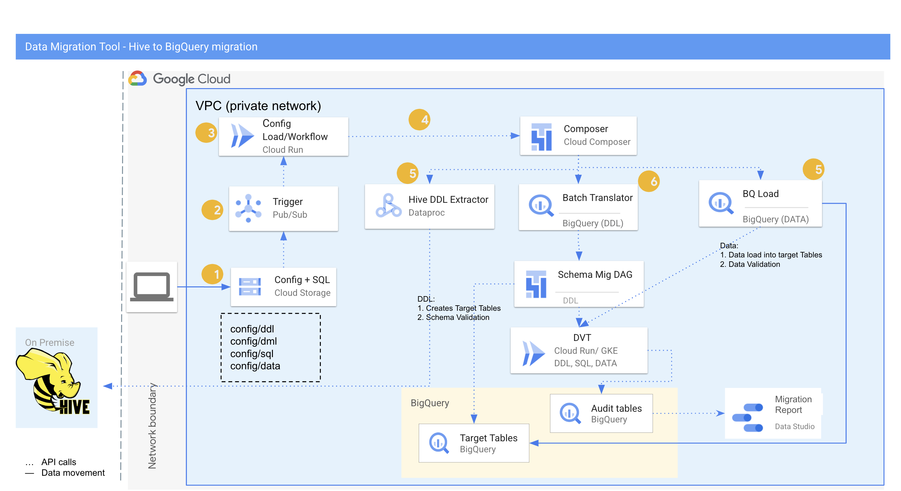

# Data Transfer Tool User Guide - Data Transfer
* For Data Transfer Tool introduction, please refer to [/README.md](/README.md)
* For Installation user guide, please refer to [/docs/installation/README.md](/docs/installation/README.md)

## About the service

### Features

* Current release supports both bulk load and incremental data transfer. 
* Current release supports Hive to BigQuery translation using BQ Load API.  
* Row and Column validation of the data in source and target using Data Validation Tool.
* The tool currently supports loading of both partition and nonpartition table. 
* The tool currently supports loading Avro, Parquet, Orc and Text files. 


### Additional Notes

* If tables from multiple databases are to be migrated, create **separate config files** for each source schema.
* Current tool version supports only bulk load which is ideally done only once, note that the transfer shall take place by the process following upload of the config files.
* If there are new table additions to a batch/config file, ideally create **a new config file** with a new table list even if rest details remain the same. If not followed, there might be multiple data transfer configs responsible for migrating the same tables.
* Note that reuploading the same configuration file or using a different config file for the same dataset and tables, may create <span style="text-decoration:underline;">data duplication</span> in the tables for the target dataset.
* Please be cautious of the number of parallel processes being triggered for Data Migration. BQ load uses free shared slot pool for [data ingestion](https://cloud.google.com/bigquery/pricing#data_ingestion_pricing), BigQuery does not make guarantees about the available capacity of this shared pool or the throughput you will see. Customers can choose flat-rate pricing for guaranteed capacity. Once the data is loaded into BigQuery, you are charged for storage.


### Prerequisites

* Service account to be created for use by bigquery migration agent on jump server, with correct permissions before uploading the configuration file as below:

    * bigquery.transfers.get
    * storage.objects.create
    * storage.objects.get
    * Storage.objects.list


### Prepare configuration file for BQ Load

The user uploads a configuration json file to **dmt-config-&lt;customer_name provided in TF>**  bucket **data** folder which initiates data migration.

As the configuration is uploaded, a new file create/update trigger is sent to pub/sub which triggers the DAG HIVE BQ load dag. This DAG is responsible for parallelizing the data transfer,  based on the user defined key - _batchDistribution_ using Airflow Dynamic Task Mapping.

## Hive Data Migration Flow




# Audit Tables for Data Migration & Validation

The below list of logging tables are created by terraform templates and record activities for Data Transfer Tool
<table>
  <tr>
   <td><strong>Dataset.Table Name</strong>

   </td>
   <td><strong>Migration Phase</strong>

   </td>
   <td><strong>Description</strong>

   </td>
  </tr>
  <tr>
   <td>dmt_logs.dmt_dvt_results

   </td>
   <td>Data Validation

   </td>
   <td>Contains data validation results for ddl/sql/data

   </td>
  </tr>
  <tr>
   <td>dmt_logs.dmt_dvt_aggregated_results

   </td>
   <td>Data Validation

   </td>
   <td>Contains data validation aggregated results

   </td>
  </tr>
  <tr>
   <td>dmt_logs.bq_load_audit

   </td>
   <td>Data Migration

   </td>
   <td>Contains status of each table load.

   </td>
  </tr>

  <tr>
   <td>dmt_logs.hive_pubsub_audit

   </td>
   <td>Incremental Data Load

   </td>
   <td>Contains status of each incremental file added to GCS.

   </td>
  </tr>

  <tr>
   <td>dmt_logs.hive_inc_load_table_list

   </td>
   <td>Incremental Data Load

   </td>
   <td>Contains copy status of each incremental file.

   </td>
  </tr>

  <tr>
   <td>dmt_logs.hive_inc_bqload_audit

   </td>
   <td>Incremental Data Load

   </td>
   <td>Contains status of each incremental file load.

   </td>
  </tr>

<table>


## Configuration file

[Data Transfer sample config file location](samples/configs/hive)


### Field Descriptions


<table>
  <tr>
   <td><strong>Configuration attribute</strong>
   </td>
   <td><strong>Description</strong>
   </td>
  </tr>
  <tr>
   <td>
    batchDistribution
   </td>
   <td>Number of tables to migrate in each batch (for each batch there will be a separate data transfer and agent run).
<p>
[Number of batches = Total number of tables / batchDistribution]
   </td>
  </tr>
  <tr>
   <td>
    unique_id
   </td>
   <td>Provide an unique name for identifying the data migration 
<p>
<strong>–</strong>
<p>
<strong>Note: </strong> If the user opted for data migration, along with schema migration through the tool, this unique id should be the same as the one used in the schema migration config file.
   </td>
  </tr>
  <tr>
   <td>
    type
   </td>
   <td>Type of migration : data
   </td>
  </tr>
  <tr>
   <td>
    source
   </td>
   <td>Source datawarehouse : hive
   </td>
  </tr>
  <tr>
   <td>
    dvt_check
   </td>
   <td>It can contain value as Y or N.  If set to Y it will pick only those tables for data migration which have passed the DVT validation check for DDL. If set to N it will pick all the tables from hive_ddl_metadata table for data migration.
   </td>
  </tr>
  <tr>
   <td>
    transfer_config
   </td>
   <td>Sub json config to be used to get configuration details for data migration
   </td>
  </tr>
  <tr>
   <td>
    transfer_config:dataSourceId
   </td>
   <td>HIVE
   </td>
  </tr>
  <tr>
   <td>
    transfer_config:rerun_flag
   </td>
   <td>In case the migration activity is stopped abruplty, user can set this as 'Y' to migrate only the left tables from the previous run.
   </td>
  </tr>
  <tr>
   <td>
    transfer_config:displayName
   </td>
   <td>Data transfer service config display name
   </td>
  </tr>
  <tr>
   <td>
    transfer_config:params:database_type
   </td>
   <td>Hive
   </td>
  </tr>
  <tr>
   <td>
    transfer_config:params:hive_db_name
   </td>
   <td>Source Hive database name that contains the tables to migrate
   </td>
  </tr>
  <tr>
   <td>
    transfer_config:params:gcs_temp_bucket
   </td>
   <td>GCS temp bucket that would used for interim outputs and calculations.  \
 \
Ideally <strong>dmt-temp-&lt;project-id> </strong>is created from terraform.
   </td>
  </tr>
  <tr>
   <td>
    transfer_config:params:hive_gcs_staging_bucket_id
   </td>
   <td>Bucket id that contains data files stored. \
Ideally <strong>dmt-teradata-data-&lt;project-id> </strong>is created from terraform.
   </td>
  </tr>
  <tr>
   <td>
    transfer_config:params:hive_gcs_staging_path
   </td>
   <td>Folder name inside the hive_gcs_staging_bucket_id that contains the data files.
   </td>
  </tr>
  <tr>
   <td>
    transfer_config:params:bq_dataset_id
   </td>
   <td>Target BQ dataset name.
   </td>
  </tr>
  <tr>
   <td>
    transfer_config:params:destinationDatasetId
   </td>
   <td>The BigQuery target dataset id.
   </td>
  </tr>
  <tr>
   <td>
    transfer_config:params:project_id
   </td>
   <td>Project number (numeric) to which migration is taking place
   </td>
  </tr>
  <tr>
   <td>
    transfer_config:params:region
   </td>
   <td>Region in which the bucket belongs
   </td>
  </tr>
  <tr>
   <td>
    validation_config
   </td>
   <td>Sub json config to be used to run DVT
   </td>
  </tr>
  <tr>
   <td>
    validation_config:source_config:source_type
   </td>
   <td><strong>DVT Validation</strong>
<p>
Source datawarehouse : Impala
   </td>
  </tr>
  <tr>
   <td>
    validation_config:source_config:host
   </td>
   <td>hostname/ IP address of on-prem Hive
   </td>
  </tr>
  <tr>
   <td>
    validation_config:source_config:port
   </td>
   <td>Port number of on-prem Impala
   </td>
  </tr>
  <tr>
   <td>
    validation_config:validation_type
   </td>
   <td>DVT validation type
<p>
Possible values - data, column
   </td>
  </tr>
  <tr>
   <td>
    validation_config:validation_mode
   </td>
   <td>DVT validation mode
<p>
Possible values - gke, cloudrun
   </td>
  </tr>
  <tr>
   <td>
    validation_config:validation_object
   </td>
   <td>DVT validation object
<p>
data
   </td>
  </tr>
</table>


**unique_id:** name to uniquely identify the load job batch. 

_<span style="text-decoration:underline;">Note:</span>_ If the user opted for data migration, along with schema migration through the tool, this unique id should be the same as the one used in the schema migration config file.

**displayName:** prefix of the bigquery data transfer service config display name

**hive_gcs_staging_bucket_id:** user provided bucket name for storing data files extracted from Hive. Ideally _dmt-teradata-data-&lt;customer_name provided in TF>_ is created using the Foundations deployment. If a user wishes to use another bucket, it needs to be created by the user/concerned team before uploading the file.

**bq_dataset_id:** Target dataset id for the particular database migrated from HIVE. 

**project-id:** numerical project id to which migration is taking place

**validation_object:** validation_object key in Validation_config needs to be _<span style="text-decoration:underline;">data</span> _for data transfer configs.

**validation_type:** validation_type key in Validation_config can be column or row depending on the requirement.

**validation_mode:** Value can be ‘cloudrun’ or ‘gke’ based on where the user want to conduct data validation.


## Validation of data in BigQuery

Composer DAG validation_dag will validate the data migrated to BQ. Results for DVT can be viewed in ```<PROJECT_ID>.dmt_logs.dmt_dvt_results.```

Below query can be used to see the results:


```
SELECT * FROM `<project-id>.dmt_logs.dmt_dvt_results` where
-- validation_type='Column'
-- run_id = <transfer_run_id>
target_table_name = <target_table_name>
```


There are two ways to validate data - column or row. Validation_type given as column verifies count aggregation on the source and target tables. Validation_type given as row verifies hash of the rows based on the primary key. Hence for row validations, providing primary_key in Validation_config json is necessary.

Check the field descriptions section for detailed information on the keys in the configuration file.

## Known Issues

<table>
  <tr>
   <td>Hive Table Format

   </td>
   <td>Data Type

   </td>
   <td>Issue Description

   </td>
   <td>Buganizer #

   </td>
   <td>Status

   </td>
  </tr>
  <tr>
   <td>Text

   </td>
   <td>Numeric

   </td>
   <td>Hive does implicit casting for the mentioned precision in the DDL. When the same data is extracted in the form of textfile the entire precision is loaded into the file which conflicts to the precision mentioned in the DDL. The causes error during BQ load.

   </td>
   <td>[b/259589505](http://b/259589505)

   </td>
   <td>Fix suggested by the BQ support team is to set a feature flag at the project level which will handle the rounding off.

   </td>
  </tr>
  <tr>
   <td>Avro
Parquet
Orc

   </td>
   <td>Float

   </td>
   <td>The way floating precion are stored in hive is different to what the data is in underlying raw files and hive. During the bq load the float column adds additional precision at the end to make it 16 digits precision.

   </td>
   <td>[b/260845659](http://b/260845659)

   </td>
   <td>Reported to the Translation team. Team is suggesting to use Numeric instead of float 64 by overwriting the translation api

   </td>
  </tr>
  <tr>
   <td>Parquet

   </td>
   <td>Array

Map

   </td>
   <td>For complex data type such as array or map for parquet file we need struct of array or struct of key. value pair. Translation API does not convert this into the required format so the data load fails.

   </td>
   <td>[b/260647109](http://b/260647109)

   </td>
   <td>Reported to Translation team

   </td>
  </tr>
  <tr>
   <td>Avro
Parquet
Orc

   </td>
   <td>Timestamp

   </td>
   <td>BQ translator API converts timestamp to Datetime which causes issues to load data for source files having schema inside the datafiles. As the data type in source is timestamp it expects the same in target

   </td>
   <td>
   </td>
   <td>Suggested work around is to use the global config to overwrite the translation api (Automatically taken care by the framework)

   </td>
  </tr>
</table>

   ### Known Issues - DVT

* DVT cannot perform validation of complex data type such as map, struct or array.
* To perform Schema validation through DVT we need to specify each table name.
* DVT fails the check if the data type does not match exactly between Hive and Bigquery. For example translation API converts int32 in hive to int64 in BQ. DVT marks this check as fail as it expects similar datatype at both places.
* DVT requires connection to the Hive DB. This could be a challenge for customers who are not comfortable with giving access to their hive data warehouse externally.