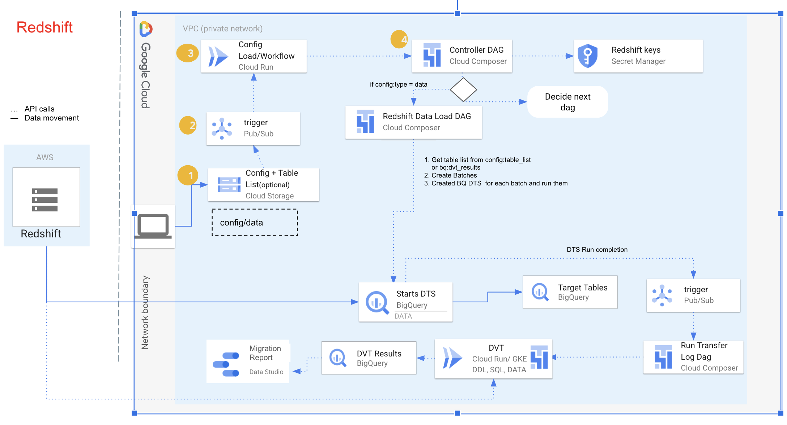

# Data Migration Tool User Guide - Data Transfer
* For Data Migration Tool introduction, please refer to [/README.md](/README.md)
* For Installation user guide, please refer to [/docs/installation/README.md](/docs/installation/README.md)

### Tool Features

* Initial release will support bulk load data transfer only.
* Initial release will support Redshift to BigQuery translation using BQ DTS, row and column validation of the data in source and target.

### Things to Take Note of


* If tables from <span style="text-decoration:underline;">multiple schemas</span> are to be migrated, create **separate config files** for each source schema.
* Current tool version supports only bulk load which is ideally done only once, note that the transfer shall take place by the process following upload of the config files.
* If there are <span style="text-decoration:underline;">new table additions to a batch/config file</span>, ideally create **a new config file** with a new table list even if rest details remain the same. If not followed, there might be multiple data transfer configs responsible for migrating the same tables.
* Note that reuploading the same configuration file or using a different config file for the same dataset and tables, will create <span style="text-decoration:underline;">data duplication</span> in the tables for the target dataset.
* Please be cautious of the number of parallel processes being triggered for Data Migration. BigQuery has a load quota of 15 TB per load job.


### Prepare configuration file for bigquery DTS

The user uploads a configuration json file to **dmt-config-&lt;customer_name provided in TF>**  bucket **data** folder which initiates data migration.

As the configuration is uploaded, a new file create/update trigger is sent to pub/sub which triggers the DAG **controller_dag** via cloudrun.
This DAG is responsible for triggering relevant schema/data migration dag based on operation type and data source given in user config, For redshit data migrationm it'll trigger  **redshift_data_load_dag** which is responsible for parallelizing the data transfer config creation, based on the user defined key - _batchDistribution_.

### Prerequisites

* Target dataset creation to be done by the user/concerned team before uploading the configuration file.
* If your redshift cluster is **private**
  * Setup VPN connection between cluster's VPC to a GCP VPC ([VPN Setup Guide](https://cloud.google.com/network-connectivity/docs/vpn/tutorials/create-ha-vpn-connections-google-cloud-aws))
  * Follow the instructions in [Configure inbound rules for SQL clients](https://docs.aws.amazon.com/redshift/latest/gsg/rs-gsg-authorize-cluster-access.html) to allowlist the IP ranges you'll reserve for private cluster. In a later step, you define the private IP range to reserve in this VPC network when you upload the config file (under key: `migration_infra_cidr`).
  * Add [custom route advertisemnt](https://cloud.google.com/vpc/docs/vpc-peering#transit-network) under cloud router for the subnet / IP Range you wish to reserve.
* If your redshift cluster is **public**
  * Follow the instructions in Configure inbound rules for SQL clients to allowlist the following IP addresses. You can allowlist the IP addresses that correspond to your dataset's location, or you can allowlist all of the IP addresses in the table [here](https://cloud.google.com/bigquery/docs/migration/redshift#grant_access_redshift_cluster). These Google-owned IP addresses are reserved for Amazon Redshift data migrations.

### Data Migration Flow



### Data Migration Tool Deployment - Redshift Data Migration

Data Migration deployment will take care of the workflow needed to perform

* Initial data load
* Data Validation using [DVT tool](https://github.com/GoogleCloudPlatform/professional-services-data-validator)
* Options to run DVT on cloud run and GKE airflow pod operator depending on scaling requirements.

Ensure that you have followed the steps to  deploy Data Migration Tool architecture as mentioned in the [readme](/README.md) with the option of `_DATA_SOURCE=redshift`

If you had previously only deployed translation architecture - you could run a delta architecture deployment for redshift migration with the below command provided the Terraform State files in remote GCS bucket from translation deployment are intact.


```
gcloud builds submit . --project ${SOURCE_PROJECT} \
--config cloudbuild_deploy.yaml \
--substitutions \
_DATA_SOURCE=redshift
```

* Check for success messages in your Cloud Build Logs for deployment of
    * Google Cloud Storage
    * Cloud Pub/Sub
    * Cloud Composer
    * Cloud Run
    * Big Query


## Audit Tables for Data Migration & Validation

The below list of logging tables are created by terraform templates and record activities for Data Migration Tool

<table>
  <tr>
    <td>
      <strong>Dataset.Table Name</strong>
    </td>
    <td>
      <strong>Migration Phase (Translation, Schema Mig, Data Mig, Validation)</strong>
    </td>
    <td>
      <strong>Description</strong>
    </td>
  </tr>
  <tr>
    <td>dmt_logs.dmt_redshift_transfer_tracking</td>
    <td>Data Migration </td>
    <td>Contains mapping for unique_id, transfer_id and config file </td>
  </tr>
  <tr>
    <td>dmt_logs.dmt_redshift_transfer_run_summary </td>
    <td>Data Migration </td>
    <td>Contains summary for DTS run </td>
  </tr>
   <tr>
    <td>dmt_logs.dmt_redshift_transfer_run_jobwise_details </td>
    <td>Data Migration </td>
    <td>Contains summary for each job in DTS runs</td>
  </tr>
</table>

## Trigger Data Migration Tool

* Data Migration
* Data Validations
* SQL Validations

#### Sample configuration file

```
{
    "unique_id":"unique_id_to_filter_bq_result_table",
   "batchDistribution": 1,
   "type": "data",
   "source": "redshift",
   "table_list_file": "gs://<dmt-redshift-data-<project-id-or-customer-name-given-in-deployment>/tables_list.csv",
   "transfer_config": {
       "dataSourceId": "redshift",
       "displayName": "unique_id_to_filter_bq_result_table",
       "params": {
           "jdbc_url": "jdbc:redshift://<host>.<region>.redshift.amazonaws.com:5439/dev",
           "database_username": "<username>",
           "database_password": "secret-<redshift_secret_name>",
           "access_key_id": "<aws_access_key_id>",
           "secret_access_key": "secret-<aws_access_key>",
           "s3_bucket": "s3://<bucketname>/",
           "redshift_schema": "<redshift_schema_name>",
           "migration_infra_cidr": "<vpc>:<10.0.0.0/24(use this variable only when your Redshift cluster is private. If its public remove this line)>"
       },
       "emailPreferences": {
           "enableFailureEmail": false
       },
       "notificationPubsubTopic": "projects/<project-id>/topics/dmt-redshift-dts-notification-topic-<project-id-or-customer-name-given-in-deployment>",
       "destinationDatasetId": "<bq_target_dataset>"
   },
   "validation_config": {
       "source_config": {
           "source_type": "redshift",
           "host": "<host>.<region>.redshift.amazonaws.com",
           "port": "5439",
           "user-name": "<source_db_username>",
           "password": "secret-<redshift_secret_name>"
       },
       "target_config": {
           "target_type": "BigQuery",
           "project-id": "<project-id>"
       },
        "validation_params_file_path" : "gs://<dmt-redshift-config-<project-id-or-customer-name-given-in-deployment>/validation/redshift/validation_params.csv",
       "validation_mode": "<gke/cloudrun>",
       "validation_type": "<row/column>",
       "pod_operator_mem" :"4000M",
       "pod_operator_cpu" :"800m"
   }
}
```

[Data Transfer sample config file location](samples/configs/redshift)


#### Field Descriptions


<table>
  <tr>
    <td>
      <strong>JSON attribute</strong>
    </td>
    <td>
      <strong>Description</strong>
    </td>
  </tr>
  <tr>
    <td> batchDistribution </td>
    <td>Number of tables to migrate in each batch (for each batch there will be a separate data transfer and agent run). <p> [Number of batches = Total number of tables / batchDistribution] </td>
  </tr>
  <tr>
    <td> unique_id </td>
    <td>Provide an unique name for identifying the data migration <p>
        <strong>–</strong>
      <p>
        <strong>Note: </strong> If the user opted for data migration, along with schema migration through the tool, this unique id should be the same as the one used in the schema migration config file.
    </td>
  </tr>
  <tr>
    <td> type </td>
    <td>Type of migration : <code>data</code></td>
  </tr>
  <tr>
    <td> source </td>
    <td>Source database: <code>redshift</code></td>
  </tr>
  <tr>
    <td> table_list_file </td>
    <td>File uploaded in GCS bucket same as the one used for uploading config file. This file should provide table names to be migrated from a particular database. <p>
        <strong>Note:</strong> <code>table_list_file</code> key only needs to be provided in case the user chooses to opt only for data migration through the tool (without schema translation).
      <p> Tables in the CSV file should always be in the same case as how they exist in source Redshift and ultimately match with validation_config source_target_table mapping in json config for DVT validations to avoid any failures in testdb.
    </td>
  </tr>
  <tr>
    <td> transfer_config </td>
    <td>Sub json config to be used to create data transfer config on bigquery <p> Refer: <a href="https://cloud.google.com/bigquery/docs/reference/datatransfer/rest/v1/projects.locations.transferConfigs#TransferConfig">REST Resource: projects.locations.transferConfigs | BigQuery | Google Cloud</a> for exhaustive keys under transfer_config sub json. </td>
  </tr>
  <tr>
    <td> transfer_config:dataSourceId </td>
    <td>redshift </td>
  </tr>
  <tr>
    <td> transfer_config:displayName </td>
    <td>Prefix of the bigquery data transfer service config display name </td>
  </tr>
  <tr>
    <td> transfer_config:params:jdbc_url </td>
    <td>The JDBC connection URL is used to locate the Amazon Redshift cluster. </td>
  </tr>
  <tr>
    <td> transfer_config:params:database_username </td>
    <td>The username to access your database to unload specified tables. </td>
  </tr>
  <tr>
    <td> transfer_config:params:database_password </td>
    <td>The password used with the username to access your database to unload specified tables. </td>
  </tr>
  <tr>
    <td> transfer_config:params:access_key_id </td>
    <td>The access key ID to sign requests made to AWS. </td>
  </tr>
  <tr>
    <td> transfer_config:params:secret_access_key </td>
    <td>The secret access key used with the access key ID to sign requests made to AWS. </td>
  </tr>
  <tr>
    <td> transfer_config:params:s3_bucket </td>
    <td>The Amazon S3 URI beginning with "s3://" and specifying a prefix for temporary files to be used. </td>
  </tr>
  <tr>
    <td> transfer_config:params:redshift_schema </td>
    <td>The Amazon Redshift schema that contains all the tables to be migrated. </td>
  </tr>
  <tr>
    <td> transfer_config:params:table_name_patterns </td>
    <td>Table name patterns separated by a semicolon (;). The table pattern is a regular expression for table(s) to migrate. If not provided, all tables under the database schema are migrated.</td>
  </tr>
  <tr>
    <td> transfer_config:params:migration_infra_cidr </td>
    <td> <strong>Optional</strong>: Use this key if your redhsift cluster is not public and you have configured VPN to a VPC network in your GCP project</br>
      Specify VPC network name and the private IP address range to use in the tenant project VPC network. Specify the IP address range as a CIDR block.
      <ul>
         <li>The form is VPC_network_name:CIDR, for example: my_vpc:10.251.1.0/24.</li>
         <li>Use standard private VPC network address ranges in the CIDR notation, starting with 10.x.x.x.</li>
         <li>The IP range must have more than 10 IP addresses.</li>
         <li>The IP range must not overlap with any subnet in your project VPC network or the Amazon Redshift VPC network.</li>
         <li>If you have multiple transfers configured for the same Amazon Redshift instance, make sure to use the same VPC_network_name:CIDR value in each, so that multiple transfers can reuse the same migration infrastructure.</li>
      </ul>
      <strong>Caution: </strong> After being configured, the value of this CIDR block is immutable.
    </td>
  </tr>
  <td> validation_config:source_config:source_type </td>
  <td>
    <strong>DVT Validation</strong>
    <p> Source datawarehouse : <code>redshift</code>
  </td>
  </tr>
  <tr>
    <td> validation_config:source_config:host </td>
    <td>Hostname/ IP address of Redshift cluster </td>
  </tr>
  <tr>
    <td> validation_config:source_config:port </td>
    <td>Port number of Redshift cluster </td>
  </tr>
  <tr>
    <td> validation_config:source_config:user-name </td>
    <td>Username with permissions to query on source tables </td>
  </tr>
  <tr>
    <td> validation_config:source_config:password </td>
    <td>Secret Manager key name <p> (Secret should be created in the Secret Manager as _secret-&lt;secret-key-name>_.)
        <strong>secret- &lt;secret key name></strong>
      <p> For example - secret-edw_credentials
    </td>
  </tr>
  <tr>
    <td> validation_config:target_config:target_type </td>
    <td>BigQuery </td>
  </tr>
  <tr>
    <td> validation_config:target_config:project-id </td>
    <td>BigQuery GCP Project ID </td>
  </tr>
  <tr>
   <td>
    validation_config:validation_params_file_path
   </td>
   <td>GCS location of the CSV file or Excel sheet, containing table or file names along with DVT Validation Flags.
   <p>
   Examples:

   gs://dmt-config-dmt-demo-project/validation/teradata/validation_params.csv

   gs://dmt-config-dmt-demo-project/validation/teradata/validation_params.xlsx

<strong><em>Read [Instructions](#instructions-to-populate-and-upload-validation-paramaters-file) below to understand how to populate and upload this file/sheet</em></strong>
   </td>
  </tr>
  <tr>
    <td> validation_config:validation_type </td>
    <td>DVT validation type <p> data </td>
  </tr>
  <tr>
    <td> validation_config:validation_mode </td>
    <td>DVT validation mode <p> Possible values - gke, cloudrun </td>
  </tr>
  <tr>
    <td> validation_config:pod_operator_mem </td>
    <td>Pod Operator memory configuration when DVT mode is chosen as GKE <p> Default Value - 4000M </td>
  </tr>
  <tr>
    <td> validation_config:pod_operator_cpu </td>
    <td>Pod Operator cpu configuration when DVT mode is chosen as GKE <p> Default Value - 800m </td>
  </tr>
</table>


**unique_id:** name to uniquely identify the batches or DTS for this config file.

_<span style="text-decoration:underline;">Note</span>_ if the user opted for data migration, along with schema migration through the tool, this unique id should be the same as the one used in the schema migration config file.

**displayName:** prefix of the bigquery data transfer service config display name

**notificationPubsubTopic:** field necessary to continue flow from Data Transfer Run Logging, including data validation. Given in the format _projects/&lt;project-name>/topics/edw-dts-notification-topic-**<customer_name provided in TF>.** Use the same topic as mentioned above, as required mappings are already done for this topic using the Foundations deployment.

**destinationDatasetId:** Target dataset id for the particular schema migrated from redshift.

**table_list_file:** file uploaded in GCS bucket same as the one used for uploading config file. This file should provide table names to be migrated from a particular schema in newlines.
Eg:
- DEPARTMENT
- EMPLOYEE
- SALARY
- HR_RECORDS


<span style="text-decoration:underline;">Note</span> that this key only needs to be provided in case the user chooses to opt only for data migration through the tool (without schema translation). As such, tables structure is created by Bigquery DTS itself rather than the CompilerWorks schema migration feature from the tool.

**_Tables in the CSV file should always be in the same case as how they exist in source Redshift and ultimately match the contents of CSV/Excel file uploaded as validation parameters file in GCS._**

**project-id:** project id to which migration is taking place

<span style="text-decoration:underline;">Note</span> that target table name case is sensitive due to case sensitive nature of bigquery. So in the case of only Data Migration, it needs to be always be in the same case as how they exist in source Redshift and ultimately match with validation_config source_target_table mapping in config.json for DVT validations

**validation_object:** validation_object key in Validation_config needs to be _<span style="text-decoration:underline;">data</span> _for data transfer configs.

**validation_type:** validation_type key in Validation_config can be column or row depending on the requirement.

**validation_mode:** Value can be ‘cloudrun’ or ‘gke’ based on where the user wants to conduct data validation.

**primary_key:** If validation_type is _row, _please provide another key called **primary_key** in the same section with the primary key for the particular table.

Refer [REST Resource: projects.locations.transferConfigs | BigQuery | Google Cloud](https://cloud.google.com/bigquery/docs/reference/datatransfer/rest/v1/projects.locations.transferConfigs#TransferConfig) for exhaustive keys under transfer_config sub json.

## Instructions To Populate And Upload Validation Paramaters File

   <strong>Please do not edit headers, data validation rules and other sheets in the Excel/Google Sheet as it'll alter the data validation checks put in-place.</strong>

   <br><strong>
   Fill the columns according to the use-case. Data Validation Rules within the sheet will help to fill the fields correctly.
   To know more about which flags are relevant for which translation (ddl,sql,custom-query) and migration (data), please refer to the tab named `DVT Guide`. This sheet contains link to DVT Github pages which explain about all possible flags in DVT CLI.

   You can refer to the tab `Example Sheet` to get an idea of which flags can be supplied for which validation. </strong>
* To follow along with Excel sheet
   * Open this [Excel Template File](/samples/validation_params_files/validation_params.xltx) in Microsoft Excel. (not in Google Sheets, as opening .xlsx in Google Sheets will corrupt the existing Data Validation Rules)
   * Fill the sheet `Validation` . Once filled, save the file in `.xlsx` format. (Excel will convert the template file format `.xltx` to `.xlsx` file for you)

  <br>
 * To follow along with CSV file format
   * Open this <a href="https://docs.google.com/spreadsheets/d/1pNgvx23sBORssZj0de7mWgB8quYw6iCXngY_giijZhk/edit#gid=0">Google Sheet</a> in browser (Viewer Access).
   * Make a copy, to get an editable sheet.
   * Once filled, download CSV file using the Menu Option. (File --> Download --> Comma Separated Values (.csv))

   <br>
   Once filled, upload the corresponding Excel (.xlsx) file or CSV file in GCS bucket, <strong><em>(inside relevant folder within dmt-config-dmt-demo-project/validation)</strong></em> and specify the GCS path in configuration file.

### Validation data in BigQuery

Composer DAG validation_dag will validate the data migrated to BQ. Results for DVT can be viewed in ``<PROJECT_ID>.dmt_logs.dmt_dvt_results``

Below query can be used to see the results:
```
SELECT * FROM `dmt-test-project.dmt_logs.dmt_dvt_results` where
-- validation_type='Column'
-- run_id = <transfer_run_id>
target_table_name = <target_table_name>
```

There are two ways to validate data - column or row. validation_type given as column verifies count aggregation on the source and target tables. validation_type given as row verifies hash of the rows based on the primary key. Hence for row validations, providing primary_key in validation_config json is necessary.

Check the field descriptions section for detailed information on the keys in the configuration file.