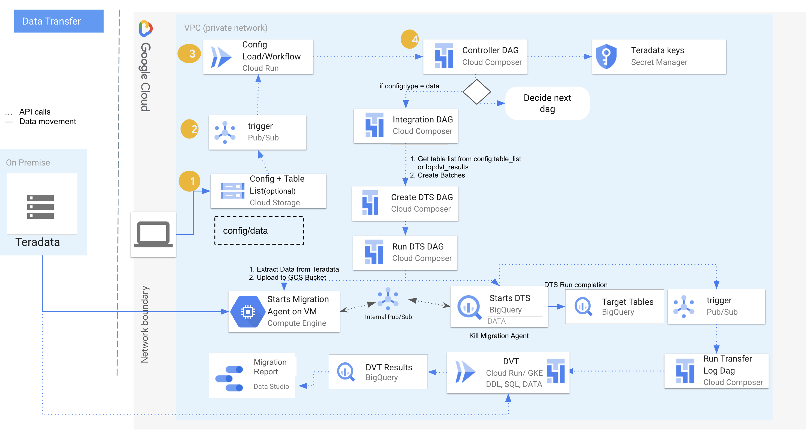

# Data Migration Tool User Guide - Data Transfer
* For Data Migration Tool introduction, please refer to [/README.md](/README.md)
* For Installation user guide, please refer to [/docs/installation/README.md](/docs/installation/README.md)

### Tool Features

* Initial release will support bulk load data transfer only.
* Initial release will support Teradata to BigQuery translation using BQ DTS, row and column validation of the data in source and target.

### Things to Take Note of


* If tables from <span style="text-decoration:underline;">multiple schemas</span> are to be migrated, create **separate config files** for each source schema.
* Current tool version supports only bulk load which is ideally done only once, note that the transfer shall take place by the process following upload of the config files.
* If there are <span style="text-decoration:underline;">new table additions to a batch/config file</span>, ideally create **a new config file** with a new table list even if rest details remain the same. If not followed, there might be multiple data transfer configs responsible for migrating the same tables.
* Note that reuploading the same configuration file or using a different config file for the same dataset and tables, will create <span style="text-decoration:underline;">data duplication</span> in the tables for the target dataset.
* Please be cautious of the number of parallel processes being triggered for Data Migration. You may need to scale the AGENT VM infrastructure (vCPUs, Memory), Composer Infrastructure based on expected parallel data migration jobs.

### Prepare configuration file for bigquery DTS

The user uploads a configuration json file to **dmt-config-&lt;project-id-or-customer-name-given-in-deployment>**  bucket **data** folder which initiates data migration.

As the configuration is uploaded, a new file create/update trigger is sent to pub/sub which triggers the DAG **controller_dag**.

### Prerequisites


* Target dataset creation to be done by the user/concerned team before uploading the configuration file.


### Data Migration Flow



### Data Migration Tool Deployment - Teradata Data Migration

Data Migration deployment will take care of the workflow needed to perform


* Initial data load
* Data Validation using [DVT tool](https://github.com/GoogleCloudPlatform/professional-services-data-validator)
* Options to run DVT on cloud run and GKE airflow pod operator depending on scaling requirements.

Ensure that you have followed the steps to  deploy Data Migration Tool architecture as mentioned in the [readme](/README.md) with the option of `_DATA_SOURCE=teradata`

If you had previously only deployed translation architecture - you could run a data architecture deployment for teradata migration with the below command provided the Terraform State files in remote GCS bucket from translation deployment are intact.


```
gcloud builds submit . --project ${SOURCE_PROJECT} \
--config cloudbuild_deploy.yaml \
--substitutions \
_DATA_SOURCE=teradata
```


* Check for success messages in your Cloud Build Logs for deployment of
    * Google Cloud Storage
    * Cloud Pub/Sub
    * Google Compute Engine
    * Cloud Composer
    * Cloud Run
    * Big Query


* Install teradata utilities on Agent VM (_dm-vm-teradata-bq_)

    1. Download utility package from teradata downloads [https://downloads.teradata.com](https://downloads.teradata.com) (Linux Package: [https://downloads.teradata.com/download/tools/teradata-tools-and-utilities-linux-installation-package-0](https://downloads.teradata.com/download/tools/teradata-tools-and-utilities-linux-installation-package-0) ).<br/>
    **Note:** Ubuntu OS has a separate software package compared to other Linux OS. Please make sure you download the Ubuntu-specific (DMT's default Terraform deployment uses Ubuntu for the Teradata Agent VM).
    2. Upload the package to a bucket (_&lt;temp-bucket>_)
    3. SSH into the Agent VM and switch user to root
    4. Copy the utility from _&lt;temp-bucket>_ to Agent VM
        _(Can also be done via web ssh console upload feature or sftp client)_
        ```
        sudo gsutil cp gs://<temp-bucket>/TeradataToolsAndUtilitiesBase__ubuntu_<version>.tar.gz /opt/migration_project_teradata_bq/
        ```
    5. Go to the `migration_project_teradata_bq` directory
       ```
        cd /opt/migration_project_teradata_bq/
       ```
    6. Extract the new package
        ```
        sudo tar -xf TeradataToolsAndUtilitiesBase__ubuntu_<version>.tar.gz
        ```
    7. Install the utilities via setup.sh (with root) : bteq, fastexp, mload, tptbase
        ```
        sudo ./TeradataToolsAndUtilitiesBase/setup.sh 1 2 5 15
        ```

* Copy Teradata JDBC JAR to Agent VM (dm-vm-teradata-bq) at path:  `/opt/migration_project_teradata_bq/`
    1. If you have not already done this during the main ReadMe setup instructions, download the JAR from Teradata downloads: [https://downloads.teradata.com/download/connectivity/jdbc-driver](https://downloads.teradata.com/download/connectivity/jdbc-driver)
    2. Upload the package to a bucket (_&lt;temp-bucket>_)
    3. SSH into the Agent VM and switch user to root
    4. Copy the Teradata JDBC JAR from _&lt;temp-bucket>_ to Agent VM (ensure it is named `terajdbc4.jar`)
        ```
        gsutil cp gs://<temp-bucket>/terajdbc4.jar /opt/migration_project_teradata_bq/
        ```


* Ensure the Teradata Agent VM (Google Compute Engine) has the following folder structure which signifies successful deployment of executables in the Agent VM `/opt/migration_project_teradata_bq/`

```
> pwd
/opt/migration_project_teradata_bq

> ls -ltr
total 115608
-rw-r--r-- 1 root  root  60156986 May 11 06:07 mirroring-agent.jar
-rw-r--r-- 1 root  root      3086 May 17 07:04 vm_start_script.sh
drwxr-xr-x 4 root  root      4096 May 17 07:05 agent_controller
-rwxr--r-- 1 root  root    192307 May 17 07:05 startup.log
-rw-r--r-- 1 root  root  56843209 May 19 11:50 TeradataToolsAndUtilitiesBase__ubuntu_x8664.17.20.11.00.tar.gz
-rw-r--r-- 1 root  root   1159293 May 19 11:50 terajdbc4.jar
drwxrwxrwx 4 root  root      4096 May 19 12:06 local_processing_space
```


## Audit Tables for Data Migration & Validation

The below list of logging tables are created by terraform templates and record activities for Data Migration Tool


<table>
  <tr>
   <td><strong>Dataset.Table Name</strong>
   </td>
   <td><strong>Migration Phase (Translation, Schema Mig, Data Mig, Validation)</strong>
   </td>
   <td><strong>Description</strong>
   </td>
  </tr>
  <tr>
   <td>dmt_logs.dmt_teradata_transfer_tracking
   </td>
   <td>Data Migration
   </td>
   <td>Containing mapping for transfer_id, agent_id and config file
   </td>
  </tr>
  <tr>
   <td>dmt_logs.dmt_teradata_transfer_run_summary
   </td>
   <td>Data Migration
   </td>
   <td>Contains summary for DTS run
   </td>
  </tr>
  <tr>
   <td>dmt_logs.dmt_teradata_transfer_run_jobwise_details
   </td>
   <td>Data Migration
   </td>
   <td>Contains DTS job wise details
   </td>
  </tr>
</table>


## Trigger Data Migration Tool


* Data Migration
* Data Validations
* SQL Validations

#### Sample configuration file

```
{
    "unique_id":"unique_id_to_filter_bq_result_table",
    "batchDistribution":1,
    "type":"data",
    "source":"teradata",
    "table_list_file": "gs://dmt-teradata-data-<project-id-or-customer-name-given-in-deployment>/tables_list.csv",
    "transfer_config":{
        "dataSourceId":"on_premises",
        "displayName":"unique_id_to_filter_bq_result_table",
        "params":{
           "database_type":"Teradata",
           "bucket":"dmt-teradata-data-<project-id-or-customer-name-given-in-deployment>",
           "database_name":"<database_name>",
           "agent_service_account":"dmt-teradata-agent-vm@<project-id>.iam.gserviceaccount.com"
        },
        "emailPreferences":{
           "enableFailureEmail":false
        },
        "notificationPubsubTopic": "projects/<project-id>/topics/dmt-teradata-dts-notification-topic-<project-id-or-customer-name-given-in-deployment>",
        "destinationDatasetId":"<bq_target_dataset>"
     },
     "agent_config":{
        "transfer-configuration":{
           "project-id":"<project-id>",
           "location":"us"
        },
        "source-type":"teradata",
        "console-log":false,
        "silent":false,
        "teradata-config":{
           "connection":{
               "host":"<source_db_host_or_ip>",
               "username": "<source_db_username>",
               "secret_resource_id": "projects/<project-id>/secrets/secret-edw_credentials/versions/<version_no>"
           },
           "local-processing-space":"/opt/migration_project_teradata_bq/local_processing_space",
           "max-local-storage":"200GB",
           "gcs-upload-chunk-size":"32MB",
           "use-tpt":true,
           "retain-tpt-files":false,
           "max-sessions":0,
           "spool-mode":"NoSpool",
           "max-parallel-upload":2,
           "max-parallel-extract-threads":2,
           "session-charset":"UTF8",
           "max-unload-file-size":"2GB"
        }
     },
     "validation_config": {
         "source_config": {
             "source_type": "Teradata",
             "host": "<source_db_host_or_ip>",
             "port": 1025,
             "user-name": "<source_db_username>",
             "password": "secret-<teradata_secret_name>"
         },
         "target_config": {
             "target_type": "BigQuery",
             "project-id": "<project-id>"
         },
         "validation_params_file_path" : "gs://<dmt-teradata-config-<project-id-or-customer-name-given-in-deployment>/validation/teradata/validation_params.csv",
         "validation_type":"<row/column>",
         "validation_mode":"<gke/cloudrun>",
         "pod_operator_mem" :"4000M",
         "pod_operator_cpu" :"800m"
     }
  }
```

[Data Transfer sample config file location](samples/configs/teradata)


#### Field Descriptions


<table>
  <tr>
   <td><strong>JSON attribute</strong>
   </td>
   <td><strong>Description</strong>
   </td>
  </tr>
  <tr>
   <td>
    unique_id
   </td>
   <td>Provide an unique name for identifying the data migration
<p>
<strong>–</strong>
<p>
<strong>Note: </strong> If the user opted for data migration, along with schema migration through the tool, this unique id should be the same as the one used in the schema migration config file.
   </td>
  </tr>
  <tr>
   <td>
    type
   </td>
   <td>Type of migration : data
   </td>
  </tr>
  <tr>
   <td>
    source
   </td>
   <td>Source datawarehouse : teradata
   </td>
  </tr>
  <tr>
   <td>
    table_list_file
   </td>
   <td>File uploaded in GCS bucket same as the one used for uploading config file. This file should provide table names to be migrated from a particular database.
<p>
<strong>Note: table_list_file</strong> key only needs to be provided in case the user chooses to opt only for data migration through the tool (without schema translation).
<p>
<strong>Tables in the CSV file should always be in the same case as how they exist in source Teradata and ultimately match with validation_config source_target_table mapping in json config for DVT validations to avoid any failures in testdb.<Strong>
   </td>
  </tr>
  <tr>
   <td>
    transfer_config
   </td>
   <td>Sub json config to be used to create data transfer config on bigquery
<p>
Refer: <a href="https://cloud.google.com/bigquery/docs/reference/datatransfer/rest/v1/projects.locations.transferConfigs#TransferConfig">REST Resource: projects.locations.transferConfigs | BigQuery | Google Cloud</a> for exhaustive keys under transfer_config sub json.
   </td>
  </tr>
  <tr>
   <td>
    transfer_config:dataSourceId
   </td>
   <td>on_premises
   </td>
  </tr>
  <tr>
   <td>
    transfer_config:displayName
   </td>
   <td>Prefix of the bigquery data transfer service config display name
   </td>
  </tr>
  <tr>
   <td>
    transfer_config:params:database_type
   </td>
   <td>Teradata
   </td>
  </tr>
  <tr>
   <td>
    transfer_config:params:bucket
   </td>
   <td>Bucket name for storing data files extracted from Teradata.
<p>
Ideally <strong>dmt-teradata-data-&lt;project-id-or-customer-name-given-in-deployment> </strong>is created using the Foundations deployment. If a user wishes to use another bucket, it needs to be created by the user/concerned team before uploading the file.
   </td>
  </tr>
  <tr>
   <td>
    transfer_config:params:database_name
   </td>
   <td>Teradata database name (from which tables needs to migrated)
   </td>
  </tr>
  <tr>
   <td>
    transfer_config:params:agent_service_account
   </td>
   <td>Service account configured on agent vm. \

<p>
Ideally <strong>dmt-dm-teradata-bq@&lt;project-id>.iam.gserviceaccount.com</strong> is created from terraform.
   </td>
  </tr>
  <tr>
   <td>
    transfer_config:emailPreferences:enableFailureEmail
   </td>
   <td>false
   </td>
  </tr>
  <tr>
   <td>
    transfer_config:notificationPubsubTopic
   </td>
   <td>PUB/SUB topic to send dts <code>run status</code>.
<p>
Ideally <strong>projects/&lt;project-id>/topics/dmt-teradata-dts-notification-topic-&lt;project-id-or-customer-name-given-in-deployment></strong> is created from terraform.
   </td>
  </tr>
  <tr>
   <td>
    transfer_config:destinationDatasetId
   </td>
   <td>The BigQuery target dataset id.
   </td>
  </tr>
  <tr>
   <td>
    agent_config
   </td>
   <td>Sub json config to be used to run migration agent
<p>
Check: <a href="https://cloud.google.com/bigquery/docs/migration/teradata#configuration_file_for_the_migration_agent">Migrate schema and data from Teradata | BigQuery | Google Cloud</a> for more
   </td>
  </tr>
  <tr>
   <td>
    agent_config:transfer-configuration:project-id
   </td>
   <td>Project id to which migration is taking place
   </td>
  </tr>
  <tr>
   <td>
    agent_config:transfer-configuration:location
   </td>
   <td>Same as data location for the dataset and DTS config
   </td>
  </tr>
  <tr>
   <td>
    agent_config:source-type
   </td>
   <td>teradata
   </td>
  </tr>
  <tr>
   <td>
    agent_config:console-log
   </td>
   <td>false
   </td>
  </tr>
  <tr>
   <td>
    agent_config:silent
   </td>
   <td>false
   </td>
  </tr>
  <tr>
   <td>
    agent_config:teradata-config:connection:host
   </td>
   <td>Hostname/ IP address of on-prem Teradata server
   </td>
  </tr>
  <tr>
   <td>
    agent_config:teradata-config:connection:username
   </td>
   <td>Teradata username with permissions to query on source tables
   </td>
  </tr>
  <tr>
   <td>
    agent_config:teradata-config:connection:secret_resource_id
   </td>
   <td>Secret Resource ID containing password for Teradata username
      For example - projects/my-project/secrets/my-secret-name/versions/1
      <em>You can copy Resource ID from Secret Manager secret's version</em>
   </td>
  </tr>
  <tr>
   <td>
    agent_config:local-processing-space
   </td>
   <td>Local Staging directory path in agent VM where data files extracted from teradata will be temporarily stored
<p>
/opt/migration_project_teradata_bq/local_processing_space
   </td>
  </tr>
  <tr>
   <td>
    agent_config:max-local-storage
   </td>
   <td>The maximum amount of local storage to use for the extraction in the specified staging directory.
<p>
The default value is 200GB. The supported format is: <em>number</em>KB|MB|GB|TB.
<p>
This parameter is not enforced for TPT extractions.
   </td>
  </tr>
  <tr>
   <td>
    agent_config:gcs-upload-chunk-size
   </td>
   <td>This parameter along with max-parallel-upload are used to control how much data gets uploaded to Cloud Storage at the same time.
   </td>
  </tr>
  <tr>
   <td>
    agent_config:max-parallel-upload
   </td>
   <td>Maximum number of threads used by the migration agent to upload files to GCS
   </td>
  </tr>
  <tr>
   <td>
    agent_config:use-tpt
   </td>
   <td>Flag to decide whether to use Teradata Parallel Transporter (TPT) as the extraction method.
<p>
If given false FastExport will be used as the extraction method.
   </td>
  </tr>
  <tr>
   <td>
    agent_config:retain-tpt-files
   </td>
   <td>false
   </td>
  </tr>
  <tr>
   <td>
    agent_config:max-sessions
   </td>
   <td>Specifies the maximum number of sessions used by the export job.
<p>
If set to 0, then the Teradata database will determine the maximum number of sessions for each export job.
   </td>
  </tr>
  <tr>
   <td>
    agent_config:spool-mode
   </td>
   <td>Default value: NoSpool.
<p>
You can change this parameter if any of the disadvantages of NoSpool apply to your case.
   </td>
  </tr>
  <tr>
   <td>
    agent_config:max-parallel-extract-threads
   </td>
   <td>Number of parallel threads used for extracting the data from Teradata.
   </td>
  </tr>
  <tr>
   <td>
    agent_config:session-charset
   </td>
   <td>Default value : UTF8
   </td>
  </tr>
  <tr>
   <td>
    agent_config:max-unload-file-size
   </td>
   <td>Determines the maximum extracted file size.
<p>
This parameter is not enforced for TPT extractions.
   </td>
  </tr>
  <tr>
   <td>
    validation_config
   </td>
   <td>Sub json config to be used to run DVT
   </td>
  </tr>
  <tr>
   <td>
    validation_config:source_config:source_type
   </td>
   <td><strong>DVT Validation</strong>
<p>
Source datawarehouse : Teradata
   </td>
  </tr>
  <tr>
   <td>
    validation_config:source_config:host
   </td>
   <td>hostname/ IP address of on-prem Teradata
   </td>
  </tr>
  <tr>
   <td>
    validation_config:source_config:port
   </td>
   <td>Port number of on-prem Teradata
   </td>
  </tr>
  <tr>
   <td>
    validation_config:source_config:user-name
   </td>
   <td>User-name with permissions to query on source tables
   </td>
  </tr>
  <tr>
   <td>
    validation_config:source_config:password
   </td>
   <td>Secret Manager key name
<p>
<strong>secret- &lt;secret key name></strong>
<p>
For example - secret-edw_credentials
   </td>
  </tr>
  <tr>
   <td>
    validation_config:target_config:target_type
   </td>
   <td>BigQuery
   </td>
  </tr>
  <tr>
   <td>
    validation_config:target_config:project-id
   </td>
   <td>BigQuery GCP Project ID
   </td>
  </tr>
 <tr>
   <td>
    validation_config:validation_params_file_path
   </td>
   <td>GCS location of the CSV file or Excel sheet, containing table or file names along with DVT Validation Flags.
   <p>
   Examples:

   gs://dmt-config-dmt-demo-project/validation/teradata/validation_params.csv

   gs://dmt-config-dmt-demo-project/validation/teradata/validation_params.xlsx

<strong><em>Read [Instructions](#instructions-to-populate-and-upload-validation-paramaters-file) below to understand how to populate and upload this file/sheet</em></strong>
   </td>
  </tr>
  <tr>
   <td>
    validation_config:validation_type
   </td>
   <td>DVT validation type
<p>
data
   </td>
  </tr>
  <tr>
   <td>
    validation_config:validation_mode
   </td>
   <td>DVT validation mode
<p>
Possible values - gke, cloudrun
   </td>
  </tr>
  <tr>
   <td>
    validation_config:pod_operator_mem
   </td>
   <td>Pod Operator memory configuration when DVT mode is chosen as GKE
<p>
Default Value - 4000M
   </td>
  </tr>
  <tr>
   <td>
    validation_config:pod_operator_cpu
   </td>
   <td>Pod Operator cpu configuration when DVT mode is chosen as GKE
<p>
Default Value - 800m
   </td>
  </tr>
</table>


**unique_id:** name to uniquely identify the batches or DTS for this config file.

_<span style="text-decoration:underline;">Note</span>_ if the user opted for data migration, along with schema migration through the tool, this unique id should be the same as the one used in the schema migration config file.

**displayName:** prefix of the bigquery data transfer service config display name

**bucket:** user provided bucket name for storing data files extracted from Teradata. Ideally _dmt-teradata-data-&lt;customer_name provided in TF>_ is created using the Foundations deployment. If a user wishes to use another bucket, it needs to be created by the user/concerned team before uploading the file.

**notificationPubsubTopic:** field necessary to continue flow from Data Transfer Run Logging, including data validation. Given in the format _projects/&lt;project-name>/topics/dmt-teradata-dts-notification-topic-**<customer_name provided in TF>.** Use the same topic as mentioned above, as required mappings are already done for this topic using the Foundations deployment.

**destinationDatasetId:** Target dataset id for the particular schema migrated from teradata.

**table_list_file:** file uploaded in GCS bucket same as the one used for uploading config file. This file should provide table names to be migrated from a particular schema in newlines.
Eg:
- DEPARTMENT
- EMPLOYEE
- SALARY
- HR_RECORDS


<span style="text-decoration:underline;">Note</span> that this key only needs to be provided in case the user chooses to opt only for data migration through the tool (without schema translation). As such, tables structure is created by Bigquery DTS itself rather than the CompilerWorks schema migration feature from the tool.

**_Tables in the CSV file should always be in the same case as how they exist in source Teradata and ultimately match the contents of CSV/Excel file uploaded as validation parameters file in GCS._**

**project-id:** project id to which migration is taking place

**location:** same as data location for the dataset

**teradata-config:** contains host, user and password keys for the teradata server. Provide password value as _secret-&lt;secret-name-suffix>_. This secret should be created in the Secret Manager as _secret-&lt;secret-name-suffix>_.

<span style="text-decoration:underline;">Note</span> that target table name case is sensitive due to case sensitive nature of bigquery. So in the case of only Data Migration, it needs to be always be in the same case as how they exist in source Teradata and ultimately match with validation_config source_target_table mapping in config.json for DVT validations

**validation_object:** validation_object key in Validation_config needs to be _<span style="text-decoration:underline;">data</span> _for data transfer configs.

**validation_type:** validation_type key in Validation_config can be column or row depending on the requirement.

**validation_mode:** Value can be ‘cloudrun’ or ‘gke’ based on where the user wants to conduct data validation.

**primary_key:** If Validation_type is _row, _please provide another key called **primary_key** in the same section with the primary key for the particular table.

Refer [REST Resource: projects.locations.transferConfigs | BigQuery | Google Cloud](https://cloud.google.com/bigquery/docs/reference/datatransfer/rest/v1/projects.locations.transferConfigs#TransferConfig) for exhaustive keys under transfer_config sub json.

## Instructions To Populate And Upload Validation Paramaters File

   <strong>Please do not edit headers, data validation rules and other sheets in the Excel/Google Sheet as it'll alter the data validation checks put in-place.</strong>

   <br><strong>
   Fill the columns according to the use-case. Data Validation Rules within the sheet will help to fill the fields correctly.
   To know more about which flags are relevant for which translation (ddl,sql,custom-query) and migration (data), please refer to the tab named `DVT Guide`. This sheet contains link to DVT Github pages which explain about all possible flags in DVT CLI.

   You can refer to the tab `Example Sheet` to get an idea of which flags can be supplied for which validation. </strong>
* To follow along with Excel sheet
   * Open this [Excel Template File](/samples/validation_params_files/validation_params.xltx) in Microsoft Excel. (not in Google Sheets, as opening .xlsx in Google Sheets will corrupt the existing Data Validation Rules)
   * Fill the sheet `Validation` . Once filled, save the file in `.xlsx` format. (Excel will convert the template file format `.xltx` to `.xlsx` file for you)

  <br>
 * To follow along with CSV file format
   * Open this <a href="https://docs.google.com/spreadsheets/d/1pNgvx23sBORssZj0de7mWgB8quYw6iCXngY_giijZhk/edit#gid=0">Google Sheet</a> in browser (Viewer Access).
   * Make a copy, to get an editable sheet.
   * Once filled, download CSV file using the Menu Option. (File --> Download --> Comma Separated Values (.csv))

   <br>
   Once filled, upload the corresponding Excel (.xlsx) file or CSV file in GCS bucket, <strong><em>(inside relevant folder within dmt-config-dmt-demo-project/validation)</strong></em> and specify the GCS path in configuration file.

## Transfer data from on-premise to BigQuery

Each of the batches are passed on to **teradata_data_load_dag** which is responsible for creating and running data transfer service configuration, and can be viewed under Data Transfers in Bigquery.

Each bigquery DTS can be identified with a transfer_run_id. The same can be tracked in table **<PROJECT_ID>.dmt_logs.dmt_teradata_transfer_tracking** with config json bucket and object path.


Below tasks happens with **teradata_data_load_dag** DAG execution
1. Migration agent will run TPT / FastExport extraction from teradata source into agent VM and upload the extracts to configured bucket
2. Data Transfer Service will load data from buckets to bigquery.


### Create tables in BigQuery

* Cloud composer will create BQ tables using translated DDL.
    OR
* DTS will create BQ tables with schema inferred from teradata exports.


### Data Transfer Run Logging

As soon as a transfer run is completed in bigquery, a pub sub message will be received at cloud run, which triggers `teradata_transfer_run_log` DAG. This DAG is responsible for

1.  Populating data transfer results in below bigquery tables:
 **<PROJECT_ID>.dmt_logs.dmt_teradata_transfer_run_summary** - Details information about the transfer run
 **<PROJECT_ID>.dmt_logs.dmt_teradata_transfer_run_jobwise_details** - Details information about each job(corresponding to a target table) within a transfer run.
2. Creating a log file for a transfer run in **dmt-teradata-datamigration-logging-<project-id-or-customer-name-given-in-deployment>** bucket. These logs are also visible in Bigquery Data Transfers. The purpose of this log file is to persist these for analysis or debug purposes. Log files are named as **<transfer_run_id>.json** under a folder name same as unique_id.
3. Filtering matching tables given in Validation config table mapping and table list, and passing these to validation_dag for data validation through DVT


### Validation data in BigQuery

Composer DAG validation_dag will validate the data migrated to BQ. Results for DVT can be viewed in ``<PROJECT_ID>.dmt_logs.dmt_dvt_results``

Below query can be used to see the results:
```
SELECT * FROM `<project-id>.dmt_logs.dmt_dvt_results` where
-- validation_type='Column'
-- run_id = <transfer_run_id>
target_table_name = <target_table_name>
```

There are two ways to validate data - column or row. Validation_type given as column verifies count aggregation on the source and target tables. Validation_type given as row verifies hash of the rows based on the primary key. Hence for row validations, providing primary_key in Validation_config json is necessary.

Check the field descriptions section for detailed information on the keys in the configuration file.